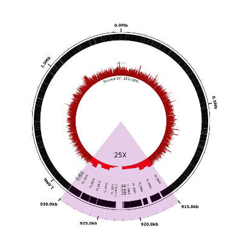
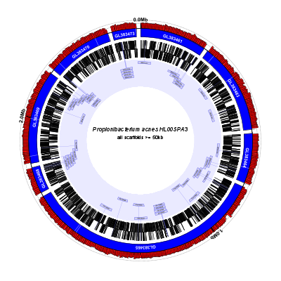
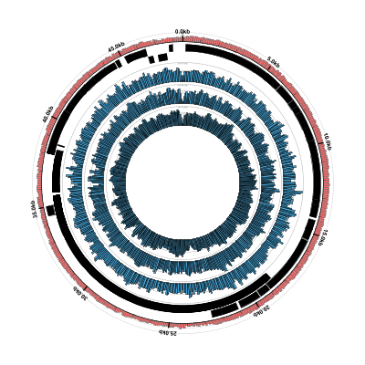

# Circleator - Gallery

A selection of Circleator-generated figures.

* *Gardnerella vaginalis HMP9231* with Bowtie-aligned metagenomic shotgun reads from 5 samples  
([config][c1], full size <a href='images/CP002725-2-5000.png'>PNG</a>&nbsp;|&nbsp;<a href='images/CP002725-2.pdf'>PDF</a>&nbsp;|&nbsp;<a href='images/CP002725-2.svg'>SVG</a>)
 

* [Example 1][gb_ex1] from the GenBank Flat File Visualization tutorial  
(a magnified and highlighted region of interest from the genome of _Haemophilus influenzae Rd KW20_)  
([config][gb_ex1_conf], full size <a href='tutorials/gb_annotation/hinf-explore-region-1-3000.png'>PNG</a>&nbsp;|&nbsp;<a href='tutorials/gb_annotation/hinf-explore-region-1.svg'>SVG</a>)
 

* [Example 2][gb_ex2] from the GenBank Flat File Visualization tutorial  
(all scaffolds &gt;= 50kb from the Draft Genome Sequence of _Propionibacterium acnes HL005PA3_)  
([config][gb_ex2_conf], full size <a href='tutorials/gb_annotation/pa-no-short-scaffolds-plus-3000.png'>PNG</a>&nbsp;|&nbsp;<a href='tutorials/gb_annotation/pa-no-short-scaffolds-plus.svg'>SVG</a>)
 

* [Example 1][cp_ex1] from the Coverage Plots tutorial  
(*Enterobacteria* phage lambda Bowtie alignments from the [Bowtie tutorial][bt2_ex])  
([config][cp_ex1_conf], full size <a href='tutorials/coverage_plots/coverage-ex1-gb-cl-3000.png'>PNG</a>&nbsp;|&nbsp;<a href='tutorials/gb_annotation/coverage-ex1-gb-cl-3000.svg'>SVG</a>)
 

* Genes, percent GC, and GC-skew for *Corynebacterium genitalium ATCC 33030*  
([config][c2], full size <a href='images/CM000961-genes-percentGC-GCskew-1-5000.png'>PNG</a>&nbsp;|&nbsp;<a href='images/CM000961-genes-percentGC-GCskew-1-5000.pdf'>PDF</a>&nbsp;|&nbsp;<a href='images/CM000961-genes-percentGC-GCskew-1-5000.svg'>SVG</a>)
 

* The Circleator logo  
([config][c3], full size <a href='images/logo-2-5000.png'>PNG</a>&nbsp;|&nbsp;<a href='images/logo-2.pdf'>PDF</a>&nbsp;|&nbsp;<a href='images/logo-2.svg'>SVG</a>)
 

[c1]: {{site.baseurl}}/gallery/CP002725-2.cfg
[c2]: {{site.baseurl}}/gallery/genes-percentGC-GCskew-1.cfg
[c3]: {{site.baseurl}}/gallery/logo-2.cfg
[gb_ex1]: {{site.baseurl}}/tutorials/gb_annotation.html#ex1
[gb_ex2]: {{site.baseurl}}/tutorials/gb_annotation.html#ex2
[cp_ex1]: {{site.baseurl}}/tutorials/coverage_plots.html#ex1
[gb_ex1_conf]: {{site.baseurl}}/tutorials/gb_annotation/explore-region-1.txt
[gb_ex2_conf]: {{site.baseurl}}/tutorials/gb_annotation/scaffolds-and-genes-plus.txt
[cp_ex1_conf]: {{site.baseurl}}/tutorials/coverage_plots/coverage-ex1.txt
[bt2_ex]: http://bowtie-bio.sourceforge.net/bowtie2/manual.shtml#getting-started-with-bowtie-2-lambda-phage-example
