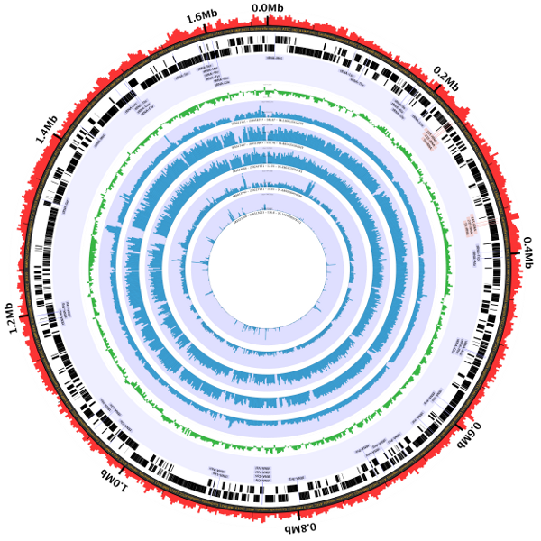
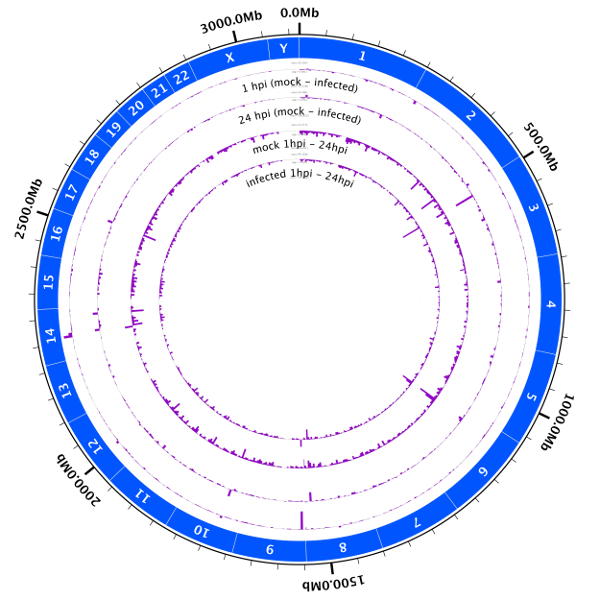

<h2>Circleator Figures</h2>

<!-- use of "&#x20;" is a workaround for a Jekyll parsing problem -->

<h3>Gardnerella vaginalis ATCC 14019 with metagenomic shotgun data from 5 samples</h3>
&#x20;
&#x20;<a href='images/CP002104-1-5000.png'>PNG</a>&nbsp;|&nbsp;PDF|&nbsp;&nbsp;<a href='images/CP002104-1.svg'>SVG</a>

<h3>Human genome with RNA-Seq data from 2 timepoints and 2 conditions</h3>
&#x20;
&#x20;<a href='images/Hs-fig-1-mi-diff-5000.png'>PNG</a>&nbsp;|&nbsp;PDF|&nbsp;&nbsp;<a href='images/Hs-fig-1-mi-diff.svg'>SVG</a>

<h3>The Circleator logo :)</h3>
&#x20;
&#x20;<a href='images/logo-2-5000.png'>PNG</a>&nbsp;|&nbsp;<a href='images/logo-2.pdf'>PDF</a>&nbsp;|&nbsp;<a href='images/logo-2.svg'>SVG</a>
