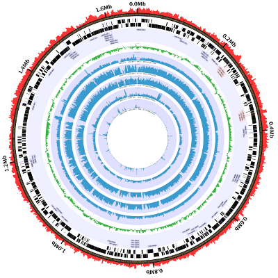
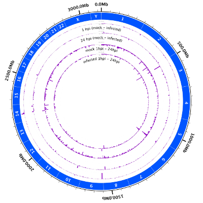

<h2>Overview</h2> 
The Charm City Circleator--or Circleator 
for short--is a visualization tool developed at the <a href='http://www.igs.umaryland.edu'>Institute for Genome
Sciences</a> in the University of Maryland's School of Medicine. The Circleator's 
goal is provide a user-friendly way to quickly produce circular plots of genome sequence and genome-sequence-associated
data, like these: 

 

More Circleator-generated figures can be found in the <a href='gallery.html'>gallery</a>.

<h2>Key Circleator features</h2>
<ul>
 <li>Implemented using <a href='http://www.bioperl.org'>BioPerl</a></li>
 <li>Supports a variety of data types and common input file formats:
  <ul>
   <li>GenBank flat file, GFF, FASTA, and any other sequence or annotation file format supported by <a href='http://www.bioperl.org'>BioPerl</a></li>
   <li>Output from the BLAST Score Ratio (BSR) tool of <a href='http://www.ncbi.nlm.nih.gov/pmc/articles/PMC545078/'>Rasko et al.</a></li>
   <li>SAM (Sequence Alignment/Map) and BAM format alignments, via the <a href='http://samtools.sourceforge.net'>SAMtools</a> package.</li>
   <li><a href='http://www.1000genomes.org/node/101'>VCF</a>-encoded SNP data, via the <a href='http://vcftools.sourceforge.net'>VCFtools</a> package</li> 
   <li>Tab-delimited quantitative data (e.g., sequence read coverage, aligned RNA-seq read counts)</li>
   <li>Output from the <a href ='http://tandem.bu.edu/trf/trf.html'>Tandem Repeats Finder</a> of <a href='http://www.ncbi.nlm.nih.gov/pubmed/9862982'>Benson</a></li>
   <li>GTF-encoded <a href='http://cufflinks.cbcb.umd.edu/'>Cufflinks</a> transcripts of <a href='http://www.nature.com/nprot/journal/v7/n3/full/nprot.2012.016.html'>Trapnell et al.</a></li>
   <li>The refGene, knownGene, and rmsk <a href='http://genome.ucsc.edu/'>UCSC genome browser</a> tables</li>
   <li>Various ad-hoc tab and comma-delimited formats for SNP, gene expression, and gene cluster data</li>
  </ul>
 </li>

 <li>Produces publication-ready output in the <a href='http://www.w3.org/Graphics/SVG/'>Scalable Vector Graphics</a> (SVG) format
  <ul>
   <li>Using SVG as the primary output format makes it easier to write regression tests.</li>
   <li>The Circleator does NOT use the GD::SVG package, which limits one to the subset of SVG that corresponds to the GD API.</li>
   <li>The Circleator leverages the <a href='http://xmlgraphics.apache.org/batik/'>Apache Batik</a> project to convert SVG to PDF, JPEG, or PNG.</li>
  </ul>
 </li>

 <li>Offers the choice of a <a href='command-line.html'>command-line</a> or <a href='web-application.html'>web-based</a> interface:
   <ul>
    <li>The command-line interface gives finer-grained control and can be incorporated into scripts or other programs.</li>
    <li>A prototype <a href='http://www.sencha.com/products/extjs/'>ExtJS</a> web interface automatically generates a configuration file, runs the Circleator, and displays the results.</li>  
   </ul>
 </li>

 <li>Provides a range of configuration options:
  <ul>
   <li>Choose from a library of customizable <a href='predefined-config-files.html'>predefined configuration files</a>, each of which generates a particular type of figure using your data.</li>
   <li>Customize or create a configuration file by choosing individual tracks from a library of customizable <a href='predefined-tracks.html'>predefined track types</a>.</li>
   <li>Create user-defined track types based on the Circleator's built-in graphical drawing primitives (glyphs).</li>
   <li>Use the Circleator's Perl API to define entirely new glyphs.</li>
  </ul>
 </li>

 <li>Extensive test suite
  <ul>
   <li>Regression tests have been written for most of the major features of the tool, helping to ensure that when we fix bugs they stay fixed :)</li>
  </ul>
 </li>

</ul>

<h2>Getting started</h2>

The <a href='documentation.html'>documentation section</a> of the web
site contains easy-to-follow tutorials that describe how to run the
Circleator using either the command-line interface or the prototype
ExtJS-based web interface.

<h2>Acknowledgments</h2>
<ul>
 <li>This product includes color specifications and designs developed by Cynthia Brewer (<a href='http://colorbrewer.org/'>http://colorbrewer.org</a>).</li>
</ul>
