# Circleator - Predefined Tracks

The Circleator provides a number of predefined circular tracks that
can be used to display various types of data with very little effort.
Simply find the appropriate predefined track type in the list below
(e.g., "genes" for a circular display of all annotated features of
type "gene") and place that keyword on a line by itself somewhere in
the Circleator configuration file.  The tracks will be drawn in the
order that they appear in the configuration file, starting with the
outside of the circle and moving inwards.  Most of the predefined track
types support one or more user-configurable options, many of which are also
described below.  Multiple options can be specified by separating them with
a comma (but no spaces), like so:

    genes color1=#ff0000,color2=#000000

The predefined tracks have been grouped into the following categories to make searching easier:

<ol>
<li><a href='#sequence_coordinates_and_contigs'>sequence coordinates and contigs</a>
<ul>
<li><a href='#coords'>coords</a></li>
<li><a href='#contigs'>contigs</a></li>
<li><a href='#contig-gaps'>contig-gaps</a></li></ul>

</li>
<li><a href='#sequence_features'>sequence features</a>
<ul>
<li><a href='#genes'>genes</a></li>
<li><a href='#genes-fwd'>genes-fwd</a></li>
<li><a href='#genes-rev'>genes-rev</a></li>
<li><a href='#tRNAs'>tRNAs</a></li>
<li><a href='#tRNAs-fwd'>tRNAs-fwd</a></li>
<li><a href='#tRNAs-rev'>tRNAs-rev</a></li>
<li><a href='#rRNAs'>rRNAs</a></li>
<li><a href='#rRNAs-fwd'>rRNAs-fwd</a></li>
<li><a href='#rRNAs-rev'>rRNAs-rev</a></li>
<li><a href='#gaps'>gaps</a></li></ul>

</li>
<li><a href='#track_layout'>track layout</a>
<ul>
<li><a href='#tiny-cgap'>tiny-cgap</a></li>
<li><a href='#small-cgap'>small-cgap</a></li>
<li><a href='#medium-cgap'>medium-cgap</a></li>
<li><a href='#large-cgap'>large-cgap</a></li></ul>

</li>
<li><a href='#graphs'>graphs</a>
<ul>
<li><a href='#%GC0-100'>%GC0-100</a></li>
<li><a href='#%GCmin-max'>%GCmin-max</a></li>
<li><a href='#%GCmin-max-dfa'>%GCmin-max-dfa</a></li>
<li><a href='#GCskew-1-df0'>GCskew-1-df0</a></li>
<li><a href='#GCskew-min-max-df0'>GCskew-min-max-df0</a></li></ul>

</li>
<li><a href='#labels'>labels</a>
<ul>
<li><a href='#small-label'>small-label</a></li>
<li><a href='#medium-label'>medium-label</a></li>
<li><a href='#large-label'>large-label</a></li></ul>
</li></ol>

<h2>1. sequence coordinates and contigs</h2>

<ul>
<li><a href='#coords'>coords</a></li>
<li><a href='#contigs'>contigs</a></li>
<li><a href='#contig-gaps'>contig-gaps</a></li></ul>
 
<h3><a name='coords'>coords</a></h3>
 The coords track draws an outer circle with small and large tick marks at intervals that can be specified 
 with the options tick-interval and label-interval.  Each large tick mark is labeled with the sequence
 coordinate at that position (e.g., 0.5Mb, 1.0Mb, 1.5Mb) using a label style specified by the label-type option.  Additional
 options can be used to control the label units (label-units, i.e., 'Mb', 'kb', 'bp'), precision 
 (the number of digits after the decimal point, label-precision), and 
 font size (font-size).  Note that if the Circleator is drawing
 a figure with multiple contigs then the coordinate labeling will include the lengths of any gaps between the contigs.
  
<table class='figure'>
<tbody>
<tr>
<th class='figure_caption' colspan='4'>coords track with default options</th>
</tr>
<tr>
<td>
10.0x
</td>
<td>
5.0x
</td>
<td>
2.0x
</td>
<td>
1.0x
</td>
</tr>
<tr>
<td colspan='4'>view/download <a href='images/predefined-tracks/coords.2.svg'>SVG</a>, <a href='images/predefined-tracks/coords.2-4000x4000.png'>large PNG image</a>, <a href='images/predefined-tracks/coords.2-2000x2000.pdf'>PDF</a> or circleator <a href='images/predefined-tracks/coords.2.cfg'>config file</a></td>
</tr>
</tbody>
</table>

<h4>coords label-type=</h4>
 The label-type can be set to 'curved' (the default), 'spoke', or 'horizontal':
  
<table class='figure'>
<tbody>
<tr>
<th class='figure_caption' colspan='4'>coords track with label-type=curved</th>
</tr>
<tr>
<td>
10.0x
</td>
<td>
5.0x
</td>
<td>
2.0x
</td>
<td>
1.0x
</td>
</tr>
<tr>
<td colspan='4'>view/download <a href='images/predefined-tracks/coords.3.svg'>SVG</a>, <a href='images/predefined-tracks/coords.3-4000x4000.png'>large PNG image</a>, <a href='images/predefined-tracks/coords.3-2000x2000.pdf'>PDF</a> or circleator <a href='images/predefined-tracks/coords.3.cfg'>config file</a></td>
</tr>
</tbody>
</table>

<table class='figure'>
<tbody>
<tr>
<th class='figure_caption' colspan='4'>coords track with label-type=spoke</th>
</tr>
<tr>
<td>
8.0x
</td>
<td>
5.0x
</td>
<td>
2.0x
</td>
<td>
1.0x
</td>
</tr>
<tr>
<td colspan='4'>view/download <a href='images/predefined-tracks/coords.4.svg'>SVG</a>, <a href='images/predefined-tracks/coords.4-4000x4000.png'>large PNG image</a>, <a href='images/predefined-tracks/coords.4-2000x2000.pdf'>PDF</a> or circleator <a href='images/predefined-tracks/coords.4.cfg'>config file</a></td>
</tr>
</tbody>
</table>

<table class='figure'>
<tbody>
<tr>
<th class='figure_caption' colspan='4'>coords track with label-type=horizontal</th>
</tr>
<tr>
<td>
10.0x
</td>
<td>
5.0x
</td>
<td>
2.0x
</td>
<td>
1.0x
</td>
</tr>
<tr>
<td colspan='4'>view/download <a href='images/predefined-tracks/coords.5.svg'>SVG</a>, <a href='images/predefined-tracks/coords.5-4000x4000.png'>large PNG image</a>, <a href='images/predefined-tracks/coords.5-2000x2000.pdf'>PDF</a> or circleator <a href='images/predefined-tracks/coords.5.cfg'>config file</a></td>
</tr>
</tbody>
</table>

<h4>coords tick-interval=</h4>
 The tick-interval option controls how frequently (in base pairs) tick marks will be drawn around
 the outer circle of the coords track:

<table class='figure'>
<tbody>
<tr>
<th class='figure_caption' colspan='4'>coords track with tick-interval=100000 (default)</th>
</tr>
<tr>
<td>
10.0x
</td>
<td>
5.0x
</td>
<td>
2.0x
</td>
<td>
1.0x
</td>
</tr>
<tr>
<td colspan='4'>view/download <a href='images/predefined-tracks/coords.6.svg'>SVG</a>, <a href='images/predefined-tracks/coords.6-4000x4000.png'>large PNG image</a>, <a href='images/predefined-tracks/coords.6-2000x2000.pdf'>PDF</a> or circleator <a href='images/predefined-tracks/coords.6.cfg'>config file</a></td>
</tr>
</tbody>
</table>

<table class='figure'>
<tbody>
<tr>
<th class='figure_caption' colspan='4'>coords track with tick-interval=50000</th>
</tr>
<tr>
<td>
10.0x
</td>
<td>
5.0x
</td>
<td>
2.0x
</td>
<td>
1.0x
</td>
</tr>
<tr>
<td colspan='4'>view/download <a href='images/predefined-tracks/coords.7.svg'>SVG</a>, <a href='images/predefined-tracks/coords.7-4000x4000.png'>large PNG image</a>, <a href='images/predefined-tracks/coords.7-2000x2000.pdf'>PDF</a> or circleator <a href='images/predefined-tracks/coords.7.cfg'>config file</a></td>
</tr>
</tbody>
</table>

<h4>coords label-interval=</h4>
 The label-interval option controls how frequently (in base pairs) a larger labeled tick mark will
 be drawn around the outer circle of the 'coords' track.  Note that if more frequent labels are 
 specified it may also be necessary to increase the label-precision, and which
 determines how many digits will be shown after the decimal point in the coordinate labels (and
 which defaults to 1.)

<table class='figure'>
<tbody>
<tr>
<th class='figure_caption' colspan='4'>coords track with label-interval=500000 (default)</th>
</tr>
<tr>
<td>
10.0x
</td>
<td>
5.0x
</td>
<td>
2.0x
</td>
<td>
1.0x
</td>
</tr>
<tr>
<td colspan='4'>view/download <a href='images/predefined-tracks/coords.8.svg'>SVG</a>, <a href='images/predefined-tracks/coords.8-4000x4000.png'>large PNG image</a>, <a href='images/predefined-tracks/coords.8-2000x2000.pdf'>PDF</a> or circleator <a href='images/predefined-tracks/coords.8.cfg'>config file</a></td>
</tr>
</tbody>
</table>

<h4>coords label-precision=</h4>
 In this example the label-interval is decreased to 200000 (200kb) and the label-precision is increased to 2:

<table class='figure'>
<tbody>
<tr>
<th class='figure_caption' colspan='4'>coords track with label-interval=200000,label-precision=2</th>
</tr>
<tr>
<td>
10.0x
</td>
<td>
5.0x
</td>
<td>
2.0x
</td>
<td>
1.0x
</td>
</tr>
<tr>
<td colspan='4'>view/download <a href='images/predefined-tracks/coords.9.svg'>SVG</a>, <a href='images/predefined-tracks/coords.9-4000x4000.png'>large PNG image</a>, <a href='images/predefined-tracks/coords.9-2000x2000.pdf'>PDF</a> or circleator <a href='images/predefined-tracks/coords.9.cfg'>config file</a></td>
</tr>
</tbody>
</table>

<h4>coords label-units=</h4>
 The label-units option may be set to 'Mb' (the default), 'kb', or 'bp':

<table class='figure'>
<tbody>
<tr>
<th class='figure_caption' colspan='4'>coords track with label-interval=200000,label-units=Mb</th>
</tr>
<tr>
<td>
10.0x
</td>
<td>
5.0x
</td>
<td>
2.0x
</td>
<td>
1.0x
</td>
</tr>
<tr>
<td colspan='4'>view/download <a href='images/predefined-tracks/coords.10.svg'>SVG</a>, <a href='images/predefined-tracks/coords.10-4000x4000.png'>large PNG image</a>, <a href='images/predefined-tracks/coords.10-2000x2000.pdf'>PDF</a> or circleator <a href='images/predefined-tracks/coords.10.cfg'>config file</a></td>
</tr>
</tbody>
</table>

<table class='figure'>
<tbody>
<tr>
<th class='figure_caption' colspan='4'>coords track with label-interval=200000,label-units=kb</th>
</tr>
<tr>
<td>
10.0x
</td>
<td>
5.0x
</td>
<td>
2.0x
</td>
<td>
1.0x
</td>
</tr>
<tr>
<td colspan='4'>view/download <a href='images/predefined-tracks/coords.11.svg'>SVG</a>, <a href='images/predefined-tracks/coords.11-4000x4000.png'>large PNG image</a>, <a href='images/predefined-tracks/coords.11-2000x2000.pdf'>PDF</a> or circleator <a href='images/predefined-tracks/coords.11.cfg'>config file</a></td>
</tr>
</tbody>
</table>

<table class='figure'>
<tbody>
<tr>
<th class='figure_caption' colspan='4'>coords track with label-interval=200000,label-units=bp</th>
</tr>
<tr>
<td>
10.0x
</td>
<td>
5.0x
</td>
<td>
2.0x
</td>
<td>
1.0x
</td>
</tr>
<tr>
<td colspan='4'>view/download <a href='images/predefined-tracks/coords.12.svg'>SVG</a>, <a href='images/predefined-tracks/coords.12-4000x4000.png'>large PNG image</a>, <a href='images/predefined-tracks/coords.12-2000x2000.pdf'>PDF</a> or circleator <a href='images/predefined-tracks/coords.12.cfg'>config file</a></td>
</tr>
</tbody>
</table>

<h3><a name='contigs'>contigs</a></h3>
 The contigs track draws a circle with a curved blue rectangle in the position of each contig/sequence
 in the input file.  It is most useful when the input contains multiple sequences:

<table class='figure'>
<tbody>
<tr>
<th class='figure_caption' colspan='4'>contigs track with default options</th>
</tr>
<tr>
<td><a href='images/predefined-tracks/contigs.1-4000x4000.png'>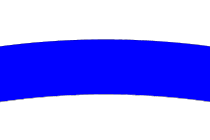</a>
10.0x
</td>
<td><a href='images/predefined-tracks/contigs.1-4000x4000.png'>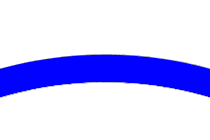</a>
5.0x
</td>
<td><a href='images/predefined-tracks/contigs.1-4000x4000.png'>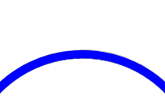</a>
2.0x
</td>
<td><a href='images/predefined-tracks/contigs.1-4000x4000.png'>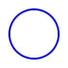</a>
1.0x
</td>
</tr>
<tr>
<td colspan='4'>view/download <a href='images/predefined-tracks/contigs.1.svg'>SVG</a>, <a href='images/predefined-tracks/contigs.1-4000x4000.png'>large PNG image</a>, <a href='images/predefined-tracks/contigs.1-2000x2000.pdf'>PDF</a> or circleator <a href='images/predefined-tracks/contigs.1.cfg'>config file</a></td>
</tr>
</tbody>
</table>

<h3><a name='contig-gaps'>contig-gaps</a></h3>
 The contig-gaps track draws a circle with a curved grey rectangle in the position of each contig gap (in multi-contig figures only)
 in the input file.
  
<table class='figure'>
<tbody>
<tr>
<th class='figure_caption' colspan='4'>contig-gaps track with default options</th>
</tr>
<tr>
<td>
10.0x
</td>
<td>
5.0x
</td>
<td>
2.0x
</td>
<td>
1.0x
</td>
</tr>
<tr>
<td colspan='4'>view/download <a href='images/predefined-tracks/contig-gaps.1.svg'>SVG</a>, <a href='images/predefined-tracks/contig-gaps.1-4000x4000.png'>large PNG image</a>, <a href='images/predefined-tracks/contig-gaps.1-2000x2000.pdf'>PDF</a> or circleator <a href='images/predefined-tracks/contig-gaps.1.cfg'>config file</a></td>
</tr>
</tbody>
</table>

<h4>contig-gaps color1=</h4>
 The color of most tracks can be changed by using the color1 and color2 
 options.  color1 typically sets the fill color whereas color2 sets the
 color used for the outline of the feature.  Currently only HTML-style hexadecimal colors of the form "#ff0000" are supported by
 these two options
  
<table class='figure'>
<tbody>
<tr>
<th class='figure_caption' colspan='4'>contigs track with color1=#ff0000</th>
</tr>
<tr>
<td>
10.0x
</td>
<td><a href='images/predefined-tracks/contigs.2-4000x4000.png'>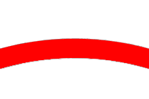</a>
5.0x
</td>
<td>
2.0x
</td>
<td><a href='images/predefined-tracks/contigs.2-4000x4000.png'>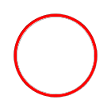</a>
1.0x
</td>
</tr>
<tr>
<td colspan='4'>view/download <a href='images/predefined-tracks/contigs.2.svg'>SVG</a>, <a href='images/predefined-tracks/contigs.2-4000x4000.png'>large PNG image</a>, <a href='images/predefined-tracks/contigs.2-2000x2000.pdf'>PDF</a> or circleator <a href='images/predefined-tracks/contigs.2.cfg'>config file</a></td>
</tr>
</tbody>
</table>

<h2>2. sequence features</h2>
<ul>
<li><a href='#genes'>genes</a></li>
<li><a href='#genes-fwd'>genes-fwd</a></li>
<li><a href='#genes-rev'>genes-rev</a></li>
<li><a href='#tRNAs'>tRNAs</a></li>
<li><a href='#tRNAs-fwd'>tRNAs-fwd</a></li>
<li><a href='#tRNAs-rev'>tRNAs-rev</a></li>
<li><a href='#rRNAs'>rRNAs</a></li>
<li><a href='#rRNAs-fwd'>rRNAs-fwd</a></li>
<li><a href='#rRNAs-rev'>rRNAs-rev</a></li>
<li><a href='#gaps'>gaps</a></li></ul>
 Several track types are provided to plot common sequence features like genes, tRNAs, and rRNAs.  Many of these track types
 come in 3 different variants, to plot either:
 <ol>
  <li>all features of that type, regardless of strand (e.g., genes)</li>
  <li>only features of that type on the forward strand (e.g., genes-fwd)</li>
  <li>only features of that type on the reverse strand (e.g., genes-rev)</li>
 </ol>
 
 In the examples below, all 3 track types are shown for the genes track, but only the
 first is shown for the other feature types:

 
<h3><a name='genes'>genes</a></h3>
<table class='figure'>
<tbody>
<tr>
<th class='figure_caption' colspan='4'>genes track with default options</th>
</tr>
<tr>
<td>
10.0x
</td>
<td>
5.0x
</td>
<td>
2.0x
</td>
<td>
1.0x
</td>
</tr>
<tr>
<td colspan='4'>view/download <a href='images/predefined-tracks/genes.1.svg'>SVG</a>, <a href='images/predefined-tracks/genes.1-4000x4000.png'>large PNG image</a>, <a href='images/predefined-tracks/genes.1-2000x2000.pdf'>PDF</a> or circleator <a href='images/predefined-tracks/genes.1.cfg'>config file</a></td>
</tr>
</tbody>
</table>

<h3><a name='genes-fwd'>genes-fwd</a></h3>
<table class='figure'>
<tbody>
<tr>
<th class='figure_caption' colspan='4'>genes-fwd track with default options</th>
</tr>
<tr>
<td>
10.0x
</td>
<td>
5.0x
</td>
<td>
2.0x
</td>
<td>
1.0x
</td>
</tr>
<tr>
<td colspan='4'>view/download <a href='images/predefined-tracks/genes-fwd.1.svg'>SVG</a>, <a href='images/predefined-tracks/genes-fwd.1-4000x4000.png'>large PNG image</a>, <a href='images/predefined-tracks/genes-fwd.1-2000x2000.pdf'>PDF</a> or circleator <a href='images/predefined-tracks/genes-fwd.1.cfg'>config file</a></td>
</tr>
</tbody>
</table>

<h3><a name='genes-rev'>genes-rev</a></h3>
<table class='figure'>
<tbody>
<tr>
<th class='figure_caption' colspan='4'>genes-rev track with default options</th>
</tr>
<tr>
<td>
10.0x
</td>
<td>
5.0x
</td>
<td>
2.0x
</td>
<td>
1.0x
</td>
</tr>
<tr>
<td colspan='4'>view/download <a href='images/predefined-tracks/genes-rev.1.svg'>SVG</a>, <a href='images/predefined-tracks/genes-rev.1-4000x4000.png'>large PNG image</a>, <a href='images/predefined-tracks/genes-rev.1-2000x2000.pdf'>PDF</a> or circleator <a href='images/predefined-tracks/genes-rev.1.cfg'>config file</a></td>
</tr>
</tbody>
</table>

<table class='figure'>
<tbody>
<tr>
<th class='figure_caption' colspan='4'>genes-fwd and genes-rev tracks together</th>
</tr>
<tr>
<td>
10.0x
</td>
<td>
5.0x
</td>
<td>
2.0x
</td>
<td>
1.0x
</td>
</tr>
<tr>
<td colspan='4'>view/download <a href='images/predefined-tracks/genes-rev.2.svg'>SVG</a>, <a href='images/predefined-tracks/genes-rev.2-4000x4000.png'>large PNG image</a>, <a href='images/predefined-tracks/genes-rev.2-2000x2000.pdf'>PDF</a> or circleator <a href='images/predefined-tracks/genes-rev.2.cfg'>config file</a></td>
</tr>
</tbody>
</table>

<h3><a name='tRNAs'>tRNAs</a></h3>
 Displays all tRNAs, regardless of strand.

<table class='figure'>
<tbody>
<tr>
<th class='figure_caption' colspan='4'>tRNAs track with default options</th>
</tr>
<tr>
<td><a href='images/predefined-tracks/tRNAs.1-4000x4000.png'>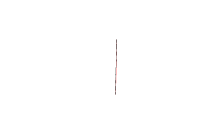</a>
10.0x
</td>
<td><a href='images/predefined-tracks/tRNAs.1-4000x4000.png'>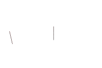</a>
5.0x
</td>
<td>
2.0x
</td>
<td><a href='images/predefined-tracks/tRNAs.1-4000x4000.png'>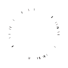</a>
1.0x
</td>
</tr>
<tr>
<td colspan='4'>view/download <a href='images/predefined-tracks/tRNAs.1.svg'>SVG</a>, <a href='images/predefined-tracks/tRNAs.1-4000x4000.png'>large PNG image</a>, <a href='images/predefined-tracks/tRNAs.1-2000x2000.pdf'>PDF</a> or circleator <a href='images/predefined-tracks/tRNAs.1.cfg'>config file</a></td>
</tr>
</tbody>
</table>

<h3><a name='tRNAs-fwd'>tRNAs-fwd</a></h3>
 Displays only forward-strand tRNAs.
  
<h3><a name='tRNAs-rev'>tRNAs-rev</a></h3>
 Displays only reverse-strand tRNAs.

<table class='figure'>
<tbody>
<tr>
<th class='figure_caption' colspan='4'>tRNAs-fwd and tRNAs-rev tracks together</th>
</tr>
<tr>
<td>
10.0x
</td>
<td>
5.0x
</td>
<td>
2.0x
</td>
<td>
1.0x
</td>
</tr>
<tr>
<td colspan='4'>view/download <a href='images/predefined-tracks/tRNAs-rev.2.svg'>SVG</a>, <a href='images/predefined-tracks/tRNAs-rev.2-4000x4000.png'>large PNG image</a>, <a href='images/predefined-tracks/tRNAs-rev.2-2000x2000.pdf'>PDF</a> or circleator <a href='images/predefined-tracks/tRNAs-rev.2.cfg'>config file</a></td>
</tr>
</tbody>
</table>

<h3><a name='rRNAs'>rRNAs</a></h3>
 Displays all rRNAs, regardless of strand.

<table class='figure'>
<tbody>
<tr>
<th class='figure_caption' colspan='4'>rRNAs track with default options</th>
</tr>
<tr>
<td>
10.0x
</td>
<td>
5.0x
</td>
<td>
2.0x
</td>
<td><a href='images/predefined-tracks/rRNAs.1-4000x4000.png'>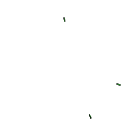</a>
1.0x
</td>
</tr>
<tr>
<td colspan='4'>view/download <a href='images/predefined-tracks/rRNAs.1.svg'>SVG</a>, <a href='images/predefined-tracks/rRNAs.1-4000x4000.png'>large PNG image</a>, <a href='images/predefined-tracks/rRNAs.1-2000x2000.pdf'>PDF</a> or circleator <a href='images/predefined-tracks/rRNAs.1.cfg'>config file</a></td>
</tr>
</tbody>
</table>

<h3><a name='rRNAs-fwd'>rRNAs-fwd</a></h3>
 Displays only forward-strand tRNAs.

<h3><a name='rRNAs-rev'>rRNAs-rev</a></h3>
 Displays only reverse-strand tRNAs.

<table class='figure'>
<tbody>
<tr>
<th class='figure_caption' colspan='4'>rRNAs-fwd and rRNAs-rev tracks together</th>
</tr>
<tr>
<td>
10.0x
</td>
<td>
5.0x
</td>
<td><a href='images/predefined-tracks/rRNAs-rev.2-4000x4000.png'>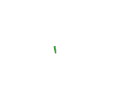</a>
2.0x
</td>
<td>
1.0x
</td>
</tr>
<tr>
<td colspan='4'>view/download <a href='images/predefined-tracks/rRNAs-rev.2.svg'>SVG</a>, <a href='images/predefined-tracks/rRNAs-rev.2-4000x4000.png'>large PNG image</a>, <a href='images/predefined-tracks/rRNAs-rev.2-2000x2000.pdf'>PDF</a> or circleator <a href='images/predefined-tracks/rRNAs-rev.2.cfg'>config file</a></td>
</tr>
</tbody>
</table>

<h3><a name='gaps'>gaps</a></h3>
 Displays all gaps, regardless of strand.  Note that these are gaps in the genomic sequence that have been 
 explicitly annotated in the input, and are distinct from the gaps that can be placed between adjacent 
 annotation tracks in Circleator figures (these are supported by the "cgap" tracks and are described in the 
<a href='#track_layout'>track layout</a> section.

<table class='figure'>
<tbody>
<tr>
<th class='figure_caption' colspan='4'>gap track with default options</th>
</tr>
<tr>
<td>
10.0x
</td>
<td>
5.0x
</td>
<td>
2.0x
</td>
<td>
1.0x
</td>
</tr>
<tr>
<td colspan='4'>view/download <a href='images/predefined-tracks/gaps.1.svg'>SVG</a>, <a href='images/predefined-tracks/gaps.1-4000x4000.png'>large PNG image</a>, <a href='images/predefined-tracks/gaps.1-2000x2000.pdf'>PDF</a> or circleator <a href='images/predefined-tracks/gaps.1.cfg'>config file</a></td>
</tr>
</tbody>
</table>

<h2>3. track layout</h2>
<ul>
<li><a href='#tiny-cgap'>tiny-cgap</a></li>
<li><a href='#small-cgap'>small-cgap</a></li>
<li><a href='#medium-cgap'>medium-cgap</a></li>
<li><a href='#large-cgap'>large-cgap</a></li></ul>
 
<h3><a name='tiny-cgap'>tiny-cgap</a></h3>
 By default the Circleator will not leave any space between adjacent tracks, making it difficult in some cases to clearly see
 the features being plotted.  To create a space between two adjacent tracks in the Circleator configuration file, simply add 
 one of the following 'gap' track types on a new line between the two adjacent tracks.  The only difference between the following
 gap types is the amount of space that each one inserts:

<table class='figure'>
<tbody>
<tr>
<th class='figure_caption' colspan='4'>tiny-cgap track</th>
</tr>
<tr>
<td>
10.0x
</td>
<td><a href='images/predefined-tracks/genes.2-4000x4000.png'>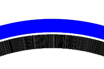</a>
5.0x
</td>
<td>
2.0x
</td>
<td><a href='images/predefined-tracks/genes.2-4000x4000.png'>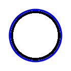</a>
1.0x
</td>
</tr>
<tr>
<td colspan='4'>view/download <a href='images/predefined-tracks/genes.2.svg'>SVG</a>, <a href='images/predefined-tracks/genes.2-4000x4000.png'>large PNG image</a>, <a href='images/predefined-tracks/genes.2-2000x2000.pdf'>PDF</a> or circleator <a href='images/predefined-tracks/genes.2.cfg'>config file</a></td>
</tr>
</tbody>
</table>

<h3><a name='small-cgap'>small-cgap</a></h3>
<table class='figure'>
<tbody>
<tr>
<th class='figure_caption' colspan='4'>small-cgap track</th>
</tr>
<tr>
<td>
10.0x
</td>
<td>
5.0x
</td>
<td><a href='images/predefined-tracks/genes.3-4000x4000.png'>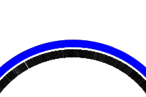</a>
2.0x
</td>
<td><a href='images/predefined-tracks/genes.3-4000x4000.png'>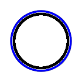</a>
1.0x
</td>
</tr>
<tr>
<td colspan='4'>view/download <a href='images/predefined-tracks/genes.3.svg'>SVG</a>, <a href='images/predefined-tracks/genes.3-4000x4000.png'>large PNG image</a>, <a href='images/predefined-tracks/genes.3-2000x2000.pdf'>PDF</a> or circleator <a href='images/predefined-tracks/genes.3.cfg'>config file</a></td>
</tr>
</tbody>
</table>

<h3><a name='medium-cgap'>medium-cgap</a></h3>
<table class='figure'>
<tbody>
<tr>
<th class='figure_caption' colspan='4'>medium-cgap track</th>
</tr>
<tr>
<td><a href='images/predefined-tracks/genes.4-4000x4000.png'>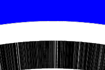</a>
10.0x
</td>
<td><a href='images/predefined-tracks/genes.4-4000x4000.png'>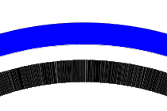</a>
5.0x
</td>
<td><a href='images/predefined-tracks/genes.4-4000x4000.png'>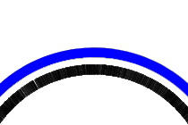</a>
2.0x
</td>
<td><a href='images/predefined-tracks/genes.4-4000x4000.png'>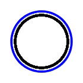</a>
1.0x
</td>
</tr>
<tr>
<td colspan='4'>view/download <a href='images/predefined-tracks/genes.4.svg'>SVG</a>, <a href='images/predefined-tracks/genes.4-4000x4000.png'>large PNG image</a>, <a href='images/predefined-tracks/genes.4-2000x2000.pdf'>PDF</a> or circleator <a href='images/predefined-tracks/genes.4.cfg'>config file</a></td>
</tr>
</tbody>
</table>

<h3><a name='large-cgap'>large-cgap</a></h3>
<table class='figure'>
<tbody>
<tr>
<th class='figure_caption' colspan='4'>large-cgap track</th>
</tr>
<tr>
<td>
10.0x
</td>
<td><a href='images/predefined-tracks/genes.5-4000x4000.png'>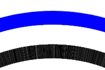</a>
5.0x
</td>
<td><a href='images/predefined-tracks/genes.5-4000x4000.png'>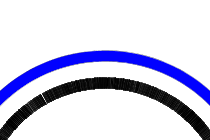</a>
2.0x
</td>
<td><a href='images/predefined-tracks/genes.5-4000x4000.png'>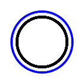</a>
1.0x
</td>
</tr>
<tr>
<td colspan='4'>view/download <a href='images/predefined-tracks/genes.5.svg'>SVG</a>, <a href='images/predefined-tracks/genes.5-4000x4000.png'>large PNG image</a>, <a href='images/predefined-tracks/genes.5-2000x2000.pdf'>PDF</a> or circleator <a href='images/predefined-tracks/genes.5.cfg'>config file</a></td>
</tr>
</tbody>
</table>

<h2>4. graphs</h2>
<ul>
<li><a href='#%GC0-100'>%GC0-100</a></li>
<li><a href='#%GCmin-max'>%GCmin-max</a></li>
<li><a href='#%GCmin-max-dfa'>%GCmin-max-dfa</a></li>
<li><a href='#GCskew-1-df0'>GCskew-1-df0</a></li>
<li><a href='#GCskew-min-max-df0'>GCskew-min-max-df0</a></li></ul>
 A number of predefined graph track types are available, and graph tracks are highly customizable.  The Circleator 
 currently supports graphing the following basic data types:
 <ul>
  <li>%GC: plots percent GC composition computed from the input sequence(s)</li>
  <li>GC-skew: plots GC skew (G-C/G+C) computed from the input sequence(s)</li>
  <li>User-defined: plots user-supplied data (TODO - not yet supported)</li>
  <li>BAM coverage: plots read coverage histograms based on the contents of a SAM or BAM alignment file (TODO - not yet supported)</li>
 </ul>
 
<h3><a name='%GC0-100'>%GC0-100</a></h3>
 A graph of percent GC sequence composition, ranging from a minimum value of 0% to a maximum value of 100%.  The
 GC percentage is computed using nonoverlapping windows of length 5kb and is plotted using a circular bar graph:

<table class='figure'>
<tbody>
<tr>
<th class='figure_caption' colspan='4'>%GC0-100 track with default options</th>
</tr>
<tr>
<td><a href='images/predefined-tracks/PercentGC0-100.1-4000x4000.png'>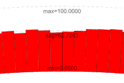</a>
20.0x
</td>
<td><a href='images/predefined-tracks/PercentGC0-100.1-4000x4000.png'>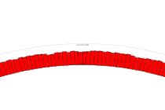</a>
5.0x
</td>
<td><a href='images/predefined-tracks/PercentGC0-100.1-4000x4000.png'>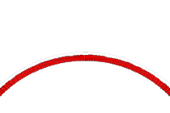</a>
2.0x
</td>
<td><a href='images/predefined-tracks/PercentGC0-100.1-4000x4000.png'>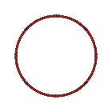</a>
1.0x
</td>
</tr>
<tr>
<td colspan='4'>view/download <a href='images/predefined-tracks/PercentGC0-100.1.svg'>SVG</a>, <a href='images/predefined-tracks/PercentGC0-100.1-4000x4000.png'>large PNG image</a>, <a href='images/predefined-tracks/PercentGC0-100.1-2000x2000.pdf'>PDF</a> or circleator <a href='images/predefined-tracks/PercentGC0-100.1.cfg'>config file</a></td>
</tr>
</tbody>
</table>

<h3><a name='%GCmin-max'>%GCmin-max</a></h3>
 The same as %GC0-100, but using the observed minimum and maximum percent GC values for the lower and upper bounds of
 the graph.  Note that the minimum, maximum, and average values are indicated directly in the figure (at the top) by default.

<table class='figure'>
<tbody>
<tr>
<th class='figure_caption' colspan='4'>%GCmin-max track with default options</th>
</tr>
<tr>
<td>
20.0x
</td>
<td><a href='images/predefined-tracks/PercentGCmin-max.1-4000x4000.png'>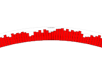</a>
5.0x
</td>
<td><a href='images/predefined-tracks/PercentGCmin-max.1-4000x4000.png'>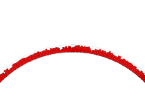</a>
2.0x
</td>
<td><a href='images/predefined-tracks/PercentGCmin-max.1-4000x4000.png'>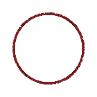</a>
1.0x
</td>
</tr>
<tr>
<td colspan='4'>view/download <a href='images/predefined-tracks/PercentGCmin-max.1.svg'>SVG</a>, <a href='images/predefined-tracks/PercentGCmin-max.1-4000x4000.png'>large PNG image</a>, <a href='images/predefined-tracks/PercentGCmin-max.1-2000x2000.pdf'>PDF</a> or circleator <a href='images/predefined-tracks/PercentGCmin-max.1.cfg'>config file</a></td>
</tr>
</tbody>
</table>

<h3><a name='%GCmin-max-dfa'>%GCmin-max-dfa</a></h3>
 A variant of %GCmin-max in which the baseline for the graph is the observed average value (dfa = Deviation From Average)
 instead of the observed minimum value, as was the case for %GCmin-max:

<table class='figure'>
<tbody>
<tr>
<th class='figure_caption' colspan='4'>%GCmin-max-dfa track with default options</th>
</tr>
<tr>
<td>
20.0x
</td>
<td><a href='images/predefined-tracks/PercentGCmin-max-dfa.1-4000x4000.png'>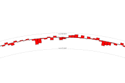</a>
5.0x
</td>
<td><a href='images/predefined-tracks/PercentGCmin-max-dfa.1-4000x4000.png'>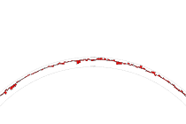</a>
2.0x
</td>
<td><a href='images/predefined-tracks/PercentGCmin-max-dfa.1-4000x4000.png'>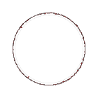</a>
1.0x
</td>
</tr>
<tr>
<td colspan='4'>view/download <a href='images/predefined-tracks/PercentGCmin-max-dfa.1.svg'>SVG</a>, <a href='images/predefined-tracks/PercentGCmin-max-dfa.1-4000x4000.png'>large PNG image</a>, <a href='images/predefined-tracks/PercentGCmin-max-dfa.1-2000x2000.pdf'>PDF</a> or circleator <a href='images/predefined-tracks/PercentGCmin-max-dfa.1.cfg'>config file</a></td>
</tr>
</tbody>
</table>

<h3><a name='GCskew-1-df0'>GCskew-1-df0</a></h3>
 A GC-skew graph with a minimum value of -1 and a maximum value of 1.  Values are plotted against a baseline value of 0

<table class='figure'>
<tbody>
<tr>
<th class='figure_caption' colspan='4'>%GCskew-1-df0 track with default options</th>
</tr>
<tr>
<td><a href='images/predefined-tracks/GCskew-1-df0.1-4000x4000.png'>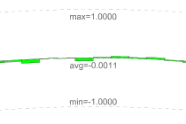</a>
20.0x
</td>
<td><a href='images/predefined-tracks/GCskew-1-df0.1-4000x4000.png'>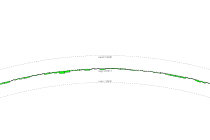</a>
5.0x
</td>
<td><a href='images/predefined-tracks/GCskew-1-df0.1-4000x4000.png'>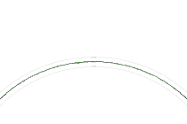</a>
2.0x
</td>
<td><a href='images/predefined-tracks/GCskew-1-df0.1-4000x4000.png'>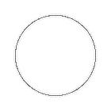</a>
1.0x
</td>
</tr>
<tr>
<td colspan='4'>view/download <a href='images/predefined-tracks/GCskew-1-df0.1.svg'>SVG</a>, <a href='images/predefined-tracks/GCskew-1-df0.1-4000x4000.png'>large PNG image</a>, <a href='images/predefined-tracks/GCskew-1-df0.1-2000x2000.pdf'>PDF</a> or circleator <a href='images/predefined-tracks/GCskew-1-df0.1.cfg'>config file</a></td>
</tr>
</tbody>
</table>

<h3><a name='GCskew-min-max-df0'>GCskew-min-max-df0</a></h3>
 A GC-skew graph with minimum and maximum values based on the observed minimum and maximum and plotted using a baseline value of 0.

<table class='figure'>
<tbody>
<tr>
<th class='figure_caption' colspan='4'>%GCskew-min-max-df0 track with default options</th>
</tr>
<tr>
<td><a href='images/predefined-tracks/GCskew-min-max-df0.1-4000x4000.png'>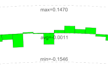</a>
20.0x
</td>
<td><a href='images/predefined-tracks/GCskew-min-max-df0.1-4000x4000.png'>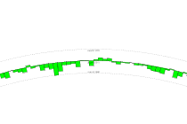</a>
5.0x
</td>
<td><a href='images/predefined-tracks/GCskew-min-max-df0.1-4000x4000.png'>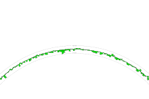</a>
2.0x
</td>
<td>
1.0x
</td>
</tr>
<tr>
<td colspan='4'>view/download <a href='images/predefined-tracks/GCskew-min-max-df0.1.svg'>SVG</a>, <a href='images/predefined-tracks/GCskew-min-max-df0.1-4000x4000.png'>large PNG image</a>, <a href='images/predefined-tracks/GCskew-min-max-df0.1-2000x2000.pdf'>PDF</a> or circleator <a href='images/predefined-tracks/GCskew-min-max-df0.1.cfg'>config file</a></td>
</tr>
</tbody>
</table>

<h4>GCskew-min-max-df0 graph-direction=</h4>
 The following options can be used with any Circleator graph track:
 The graph-direction can be set to 'out' (the default) or 'in'.  A graph direction of 'out' places lower
 values on the y-axis closer to the center of the circle and higher values on the y-axis closer to the outside of the circle.  
 A graph direction of 'in' does the opposite.

<table class='figure'>
<tbody>
<tr>
<th class='figure_caption' colspan='4'>%GCmin-max track with graph-direction=out</th>
</tr>
<tr>
<td>
20.0x
</td>
<td>
5.0x
</td>
<td>
2.0x
</td>
<td>
1.0x
</td>
</tr>
<tr>
<td colspan='4'>view/download <a href='images/predefined-tracks/PercentGCmin-max.2.svg'>SVG</a>, <a href='images/predefined-tracks/PercentGCmin-max.2-4000x4000.png'>large PNG image</a>, <a href='images/predefined-tracks/PercentGCmin-max.2-2000x2000.pdf'>PDF</a> or circleator <a href='images/predefined-tracks/PercentGCmin-max.2.cfg'>config file</a></td>
</tr>
</tbody>
</table>

<table class='figure'>
<tbody>
<tr>
<th class='figure_caption' colspan='4'>%GCmin-max track with graph-direction=in</th>
</tr>
<tr>
<td><a href='images/predefined-tracks/PercentGCmin-max.3-4000x4000.png'>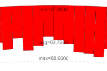</a>
20.0x
</td>
<td><a href='images/predefined-tracks/PercentGCmin-max.3-4000x4000.png'>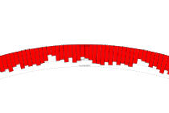</a>
5.0x
</td>
<td>
2.0x
</td>
<td><a href='images/predefined-tracks/PercentGCmin-max.3-4000x4000.png'>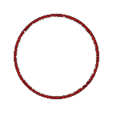</a>
1.0x
</td>
</tr>
<tr>
<td colspan='4'>view/download <a href='images/predefined-tracks/PercentGCmin-max.3.svg'>SVG</a>, <a href='images/predefined-tracks/PercentGCmin-max.3-4000x4000.png'>large PNG image</a>, <a href='images/predefined-tracks/PercentGCmin-max.3-2000x2000.pdf'>PDF</a> or circleator <a href='images/predefined-tracks/PercentGCmin-max.3.cfg'>config file</a></td>
</tr>
</tbody>
</table>

<h4>GCskew-min-max-df0 graph-type=</h4>
 The graph-type can be set to 'bar' (the default) or 'line'.  The former plots a bar graph whereas the latter
 plots a line graph:

<table class='figure'>
<tbody>
<tr>
<th class='figure_caption' colspan='4'>%GCmin-max track with graph-type=bar</th>
</tr>
<tr>
<td>
20.0x
</td>
<td>
5.0x
</td>
<td>
2.0x
</td>
<td><a href='images/predefined-tracks/PercentGCmin-max.4-4000x4000.png'>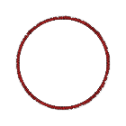</a>
1.0x
</td>
</tr>
<tr>
<td colspan='4'>view/download <a href='images/predefined-tracks/PercentGCmin-max.4.svg'>SVG</a>, <a href='images/predefined-tracks/PercentGCmin-max.4-4000x4000.png'>large PNG image</a>, <a href='images/predefined-tracks/PercentGCmin-max.4-2000x2000.pdf'>PDF</a> or circleator <a href='images/predefined-tracks/PercentGCmin-max.4.cfg'>config file</a></td>
</tr>
</tbody>
</table>

<table class='figure'>
<tbody>
<tr>
<th class='figure_caption' colspan='4'>%GCmin-max track with graph-type=line</th>
</tr>
<tr>
<td>
20.0x
</td>
<td>
5.0x
</td>
<td>
2.0x
</td>
<td>
1.0x
</td>
</tr>
<tr>
<td colspan='4'>view/download <a href='images/predefined-tracks/PercentGCmin-max.5.svg'>SVG</a>, <a href='images/predefined-tracks/PercentGCmin-max.5-4000x4000.png'>large PNG image</a>, <a href='images/predefined-tracks/PercentGCmin-max.5-2000x2000.pdf'>PDF</a> or circleator <a href='images/predefined-tracks/PercentGCmin-max.5.cfg'>config file</a></td>
</tr>
</tbody>
</table>

<h4>GCskew-min-max-df0 window-size=</h4>
 The window-size option determines the size of the window (in base pairs) over which the sequence-based 
 functions are computed.  It is set to 5000 bp by default but can be customized as needed:

<table class='figure'>
<tbody>
<tr>
<th class='figure_caption' colspan='4'>%GCmin-max track with window-size=5000</th>
</tr>
<tr>
<td>
20.0x
</td>
<td>
5.0x
</td>
<td>
2.0x
</td>
<td>
1.0x
</td>
</tr>
<tr>
<td colspan='4'>view/download <a href='images/predefined-tracks/PercentGCmin-max.6.svg'>SVG</a>, <a href='images/predefined-tracks/PercentGCmin-max.6-4000x4000.png'>large PNG image</a>, <a href='images/predefined-tracks/PercentGCmin-max.6-2000x2000.pdf'>PDF</a> or circleator <a href='images/predefined-tracks/PercentGCmin-max.6.cfg'>config file</a></td>
</tr>
</tbody>
</table>

<table class='figure'>
<tbody>
<tr>
<th class='figure_caption' colspan='4'>%GCmin-max track with window-size=15000</th>
</tr>
<tr>
<td><a href='images/predefined-tracks/PercentGCmin-max.7-4000x4000.png'>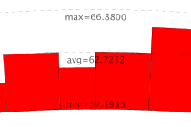</a>
20.0x
</td>
<td>
5.0x
</td>
<td><a href='images/predefined-tracks/PercentGCmin-max.7-4000x4000.png'>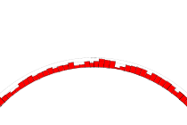</a>
2.0x
</td>
<td><a href='images/predefined-tracks/PercentGCmin-max.7-4000x4000.png'>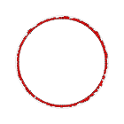</a>
1.0x
</td>
</tr>
<tr>
<td colspan='4'>view/download <a href='images/predefined-tracks/PercentGCmin-max.7.svg'>SVG</a>, <a href='images/predefined-tracks/PercentGCmin-max.7-4000x4000.png'>large PNG image</a>, <a href='images/predefined-tracks/PercentGCmin-max.7-2000x2000.pdf'>PDF</a> or circleator <a href='images/predefined-tracks/PercentGCmin-max.7.cfg'>config file</a></td>
</tr>
</tbody>
</table>

<h4>GCskew-min-max-df0 graph-min=</h4>
<h4>GCskew-min-max-df0 graph-max=</h4>
 The graph-min and graph-max options specify the minimum value to be 
plotted on the graph's y-axis.  Each can be set to either a number (e.g., to 0 for the %GC0-100 graph), or to 
the special value 'data_min' to use the minimum value observed in the current sequence data, 'data_max' to use the maximum value observed
in the current sequence data, or 'data_avg' to use the average value:

<table class='figure'>
<tbody>
<tr>
<th class='figure_caption' colspan='4'>%GCmin-max track with graph-min=0,graph-max=100</th>
</tr>
<tr>
<td><a href='images/predefined-tracks/PercentGCmin-max.8-4000x4000.png'>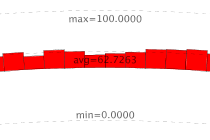</a>
20.0x
</td>
<td><a href='images/predefined-tracks/PercentGCmin-max.8-4000x4000.png'>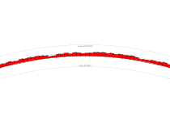</a>
5.0x
</td>
<td>
2.0x
</td>
<td><a href='images/predefined-tracks/PercentGCmin-max.8-4000x4000.png'>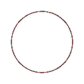</a>
1.0x
</td>
</tr>
<tr>
<td colspan='4'>view/download <a href='images/predefined-tracks/PercentGCmin-max.8.svg'>SVG</a>, <a href='images/predefined-tracks/PercentGCmin-max.8-4000x4000.png'>large PNG image</a>, <a href='images/predefined-tracks/PercentGCmin-max.8-2000x2000.pdf'>PDF</a> or circleator <a href='images/predefined-tracks/PercentGCmin-max.8.cfg'>config file</a></td>
</tr>
</tbody>
</table>

<table class='figure'>
<tbody>
<tr>
<th class='figure_caption' colspan='4'>%GCmin-max track with graph-min=50</th>
</tr>
<tr>
<td><a href='images/predefined-tracks/PercentGCmin-max.9-4000x4000.png'>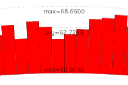</a>
20.0x
</td>
<td>
5.0x
</td>
<td>
2.0x
</td>
<td>
1.0x
</td>
</tr>
<tr>
<td colspan='4'>view/download <a href='images/predefined-tracks/PercentGCmin-max.9.svg'>SVG</a>, <a href='images/predefined-tracks/PercentGCmin-max.9-4000x4000.png'>large PNG image</a>, <a href='images/predefined-tracks/PercentGCmin-max.9-2000x2000.pdf'>PDF</a> or circleator <a href='images/predefined-tracks/PercentGCmin-max.9.cfg'>config file</a></td>
</tr>
</tbody>
</table>

<table class='figure'>
<tbody>
<tr>
<th class='figure_caption' colspan='4'>%GCmin-max track with graph-min=data_min</th>
</tr>
<tr>
<td>
20.0x
</td>
<td>
5.0x
</td>
<td>
2.0x
</td>
<td>
1.0x
</td>
</tr>
<tr>
<td colspan='4'>view/download <a href='images/predefined-tracks/PercentGCmin-max.10.svg'>SVG</a>, <a href='images/predefined-tracks/PercentGCmin-max.10-4000x4000.png'>large PNG image</a>, <a href='images/predefined-tracks/PercentGCmin-max.10-2000x2000.pdf'>PDF</a> or circleator <a href='images/predefined-tracks/PercentGCmin-max.10.cfg'>config file</a></td>
</tr>
</tbody>
</table>

<h4>GCskew-min-max-df0 graph-baseline=</h4>
 The graph-baseline option is only relevant for bar graphs and it specifies the baseline of the graph, meaning the point from 
 which the rectangles making up the graph will be drawn.  Setting the graph-baseline to the same value as graph-min (the default) will display a
 traditional bar graph, and setting the graph-baseline to some other value between the min and the max can be used to illustrate the deviation from 
 that value--either above or below it--at any given point in the sequence:

<table class='figure'>
<tbody>
<tr>
<th class='figure_caption' colspan='4'>%GCmin-max track with graph-baseline=0</th>
</tr>
<tr>
<td>
20.0x
</td>
<td>
5.0x
</td>
<td>
2.0x
</td>
<td>
1.0x
</td>
</tr>
<tr>
<td colspan='4'>view/download <a href='images/predefined-tracks/PercentGCmin-max.11.svg'>SVG</a>, <a href='images/predefined-tracks/PercentGCmin-max.11-4000x4000.png'>large PNG image</a>, <a href='images/predefined-tracks/PercentGCmin-max.11-2000x2000.pdf'>PDF</a> or circleator <a href='images/predefined-tracks/PercentGCmin-max.11.cfg'>config file</a></td>
</tr>
</tbody>
</table>

<table class='figure'>
<tbody>
<tr>
<th class='figure_caption' colspan='4'>%GCmin-max track with graph-baseline=60</th>
</tr>
<tr>
<td>
20.0x
</td>
<td>
5.0x
</td>
<td>
2.0x
</td>
<td>
1.0x
</td>
</tr>
<tr>
<td colspan='4'>view/download <a href='images/predefined-tracks/PercentGCmin-max.12.svg'>SVG</a>, <a href='images/predefined-tracks/PercentGCmin-max.12-4000x4000.png'>large PNG image</a>, <a href='images/predefined-tracks/PercentGCmin-max.12-2000x2000.pdf'>PDF</a> or circleator <a href='images/predefined-tracks/PercentGCmin-max.12.cfg'>config file</a></td>
</tr>
</tbody>
</table>

<h2>5. labels</h2>
<ul>
<li><a href='#small-label'>small-label</a></li>
<li><a href='#medium-label'>medium-label</a></li>
<li><a href='#large-label'>large-label</a></li></ul>
 Circleator figures can also include text, by way of label tracks.  The following basic label track types allow text of 
 varying sizes to be placed in the figure.  The text to include is specified by the label-text
 option and the text will appear centered around the 0 bp position by default.  To move the text to a different location
 around the circle, use the position option.  The type of label to use is specified by the
 label-type option.
 
<h3><a name='small-label'>small-label</a></h3>
<table class='figure'>
<tbody>
<tr>
<th class='figure_caption' colspan='4'>small-label track with label-text=Label1</th>
</tr>
<tr>
<td>
10.0x
</td>
<td>
5.0x
</td>
<td>
2.0x
</td>
<td>
1.0x
</td>
</tr>
<tr>
<td colspan='4'>view/download <a href='images/predefined-tracks/small-label.2.svg'>SVG</a>, <a href='images/predefined-tracks/small-label.2-4000x4000.png'>large PNG image</a>, <a href='images/predefined-tracks/small-label.2-2000x2000.pdf'>PDF</a> or circleator <a href='images/predefined-tracks/small-label.2.cfg'>config file</a></td>
</tr>
</tbody>
</table>

<h3><a name='medium-label'>medium-label</a></h3>
<table class='figure'>
<tbody>
<tr>
<th class='figure_caption' colspan='4'>medium-label track with label-text=Label1</th>
</tr>
<tr>
<td>
10.0x
</td>
<td>
5.0x
</td>
<td>
2.0x
</td>
<td>
1.0x
</td>
</tr>
<tr>
<td colspan='4'>view/download <a href='images/predefined-tracks/medium-label.2.svg'>SVG</a>, <a href='images/predefined-tracks/medium-label.2-4000x4000.png'>large PNG image</a>, <a href='images/predefined-tracks/medium-label.2-2000x2000.pdf'>PDF</a> or circleator <a href='images/predefined-tracks/medium-label.2.cfg'>config file</a></td>
</tr>
</tbody>
</table>

<h3><a name='large-label'>large-label</a></h3>
<table class='figure'>
<tbody>
<tr>
<th class='figure_caption' colspan='4'>large-label track with label-text=Label1</th>
</tr>
<tr>
<td>
10.0x
</td>
<td>
5.0x
</td>
<td>
2.0x
</td>
<td>
1.0x
</td>
</tr>
<tr>
<td colspan='4'>view/download <a href='images/predefined-tracks/large-label.2.svg'>SVG</a>, <a href='images/predefined-tracks/large-label.2-4000x4000.png'>large PNG image</a>, <a href='images/predefined-tracks/large-label.2-2000x2000.pdf'>PDF</a> or circleator <a href='images/predefined-tracks/large-label.2.cfg'>config file</a></td>
</tr>
</tbody>
</table>

<h4>large-label label-type=</h4>
 The label-type can be set to 'curved' (the default), 'spoke', or 'horizontal':

<table class='figure'>
<tbody>
<tr>
<th class='figure_caption' colspan='4'>large-label track with label-type=curved</th>
</tr>
<tr>
<td>
10.0x
</td>
<td>
5.0x
</td>
<td>
2.0x
</td>
<td>
1.0x
</td>
</tr>
<tr>
<td colspan='4'>view/download <a href='images/predefined-tracks/medium-label.3.svg'>SVG</a>, <a href='images/predefined-tracks/medium-label.3-4000x4000.png'>large PNG image</a>, <a href='images/predefined-tracks/medium-label.3-2000x2000.pdf'>PDF</a> or circleator <a href='images/predefined-tracks/medium-label.3.cfg'>config file</a></td>
</tr>
</tbody>
</table>

<table class='figure'>
<tbody>
<tr>
<th class='figure_caption' colspan='4'>large-label track with label-type=spoke</th>
</tr>
<tr>
<td>
10.0x
</td>
<td>
5.0x
</td>
<td>
2.0x
</td>
<td>
1.0x
</td>
</tr>
<tr>
<td colspan='4'>view/download <a href='images/predefined-tracks/medium-label.4.svg'>SVG</a>, <a href='images/predefined-tracks/medium-label.4-4000x4000.png'>large PNG image</a>, <a href='images/predefined-tracks/medium-label.4-2000x2000.pdf'>PDF</a> or circleator <a href='images/predefined-tracks/medium-label.4.cfg'>config file</a></td>
</tr>
</tbody>
</table>

<table class='figure'>
<tbody>
<tr>
<th class='figure_caption' colspan='4'>large-label track with label-type=horizontal</th>
</tr>
<tr>
<td>
10.0x
</td>
<td>
5.0x
</td>
<td>
2.0x
</td>
<td>
1.0x
</td>
</tr>
<tr>
<td colspan='4'>view/download <a href='images/predefined-tracks/medium-label.5.svg'>SVG</a>, <a href='images/predefined-tracks/medium-label.5-4000x4000.png'>large PNG image</a>, <a href='images/predefined-tracks/medium-label.5-2000x2000.pdf'>PDF</a> or circleator <a href='images/predefined-tracks/medium-label.5.cfg'>config file</a></td>
</tr>
</tbody>
</table>

<h4>large-label label-position=</h4>
<table class='figure'>
<tbody>
<tr>
<th class='figure_caption' colspan='4'>large-label track with label-text=Label1, label-position=100000</th>
</tr>
<tr>
<td>
10.0x
</td>
<td>
5.0x
</td>
<td>
2.0x
</td>
<td>
1.0x
</td>
</tr>
<tr>
<td colspan='4'>view/download <a href='images/predefined-tracks/medium-label.6.svg'>SVG</a>, <a href='images/predefined-tracks/medium-label.6-4000x4000.png'>large PNG image</a>, <a href='images/predefined-tracks/medium-label.6-2000x2000.pdf'>PDF</a> or circleator <a href='images/predefined-tracks/medium-label.6.cfg'>config file</a></td>
</tr>
</tbody>
</table>

<h4>large-label label-text-anchor=</h4>
 The label-text-anchor option specifies where the label should be positioned relative to its 
 sequence location (i.e., the value passed to the position option.  It can be set to 
 'center' (the default), 'start', or 'end'.

<table class='figure'>
<tbody>
<tr>
<th class='figure_caption' colspan='4'>medium-label track with label-text-anchor=middle</th>
</tr>
<tr>
<td>
10.0x
</td>
<td>
5.0x
</td>
<td>
2.0x
</td>
<td>
1.0x
</td>
</tr>
<tr>
<td colspan='4'>view/download <a href='images/predefined-tracks/medium-label.7.svg'>SVG</a>, <a href='images/predefined-tracks/medium-label.7-4000x4000.png'>large PNG image</a>, <a href='images/predefined-tracks/medium-label.7-2000x2000.pdf'>PDF</a> or circleator <a href='images/predefined-tracks/medium-label.7.cfg'>config file</a></td>
</tr>
</tbody>
</table>

<table class='figure'>
<tbody>
<tr>
<th class='figure_caption' colspan='4'>medium-label track with label-text-anchor=start</th>
</tr>
<tr>
<td>
10.0x
</td>
<td>
5.0x
</td>
<td>
2.0x
</td>
<td>
1.0x
</td>
</tr>
<tr>
<td colspan='4'>view/download <a href='images/predefined-tracks/medium-label.8.svg'>SVG</a>, <a href='images/predefined-tracks/medium-label.8-4000x4000.png'>large PNG image</a>, <a href='images/predefined-tracks/medium-label.8-2000x2000.pdf'>PDF</a> or circleator <a href='images/predefined-tracks/medium-label.8.cfg'>config file</a></td>
</tr>
</tbody>
</table>

<table class='figure'>
<tbody>
<tr>
<th class='figure_caption' colspan='4'>medium-label track with label-text-anchor=end</th>
</tr>
<tr>
<td>
10.0x
</td>
<td>
5.0x
</td>
<td>
2.0x
</td>
<td>
1.0x
</td>
</tr>
<tr>
<td colspan='4'>view/download <a href='images/predefined-tracks/medium-label.9.svg'>SVG</a>, <a href='images/predefined-tracks/medium-label.9-4000x4000.png'>large PNG image</a>, <a href='images/predefined-tracks/medium-label.9-2000x2000.pdf'>PDF</a> or circleator <a href='images/predefined-tracks/medium-label.9.cfg'>config file</a></td>
</tr>
</tbody>
</table>
