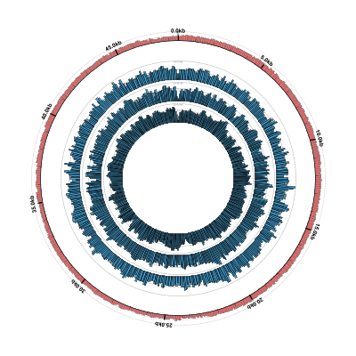
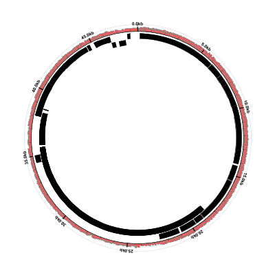
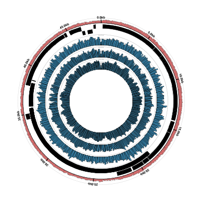
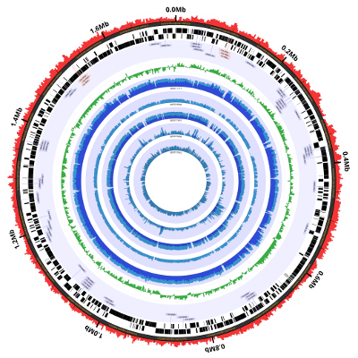

# Coverage Plots Using BAM Files

In this tutorial we'll look at plotting coverage data from BAM
files. We use the term "coverage" rather than "alignment" because
Circleator does not support plotting individual alignments directly
from BAM format input, but it can generate simple depth-of-coverage
plots to help visualize the content of a BAM file. We'll look at two
different ways of making coverage plots from BAM files:

1. Using the BAM-specific "BAMCoverage" graph function to plot the contents of a BAM file directly.
2. Using the generic "FlatFile" graph function to plot summarized coverage data from a tab-delimited flat file.

It is important to note that both approaches depend in one way or
another on the [samtools toolkit]. The first method, using the
"BAMCoverage" graph-function, relies on an external call to `samtools
mpileup` in order to generate the required coverage data. This means
that: 1. Circleator must be able to find the `samtools` executable in
the current path and; 2. Generating the coverage data can be quite
slow, particularly for large BAM files, and this process must be
repeated every time Circleator is run. The second method, using the
"FlatFile" graph-function, reads the coverage data from a
tab-delimited flat file.  That flat file, however, must be generated
prior to running Circleator, and the recommended method for doing this
entails the use of a small C program (available on GitHub) that must
be compiled against the samtools package. The main advantage of this
approach is that the expense of building the pileup and computing the
coverage depths need be incurred only once per input BAM file.

Before proceeding with the tutorial, please make
sure that you have Circleator installed as described in the Circleator
[Installation Guide][install].

[install]: {{site.baseurl}}/install.html
[samtools toolkit]: http://samtools.sourceforge.net/

### Outline

* [Example 1](#ex1): *Enterobacteria* phage lambda: BAM file coverage using "BAMCoverage" 

  1. [Download the phage genome's FASTA file](#ex1_download_fasta)
  2. [Download the BAM files](#ex1_download_bam)
  3. [Download the Circleator configuration file](#ex1_download_config)
  4. [Run Circleator](#ex1_run_circleator)
  5. [Convert the figure from SVG to PNG](#ex1_convert_to_png)
  6. [Download the phage genome's GenBank flat file](#ex1_download_gb_ff)
  7. [Run Circleator again](#ex1_run_circleator_2)
  8. [Download the sample contig list file](#ex1_download_gb_cl)
  9. [Run Circleator a third time](#ex1_run_circleator_3)

` `

* [Example 2](#ex2): *Enterobacteria* phage lambda: BAM file coverage using "FlatFile" 

  1. [Download and compile bam_get_coverage](#ex2_compile_bam_get_coverage)
  2. [Convert BAM files to tab-delimited summary files](#ex2_convert_bam_files)
  3. [Download the Circleator configuration file](#ex2_download_config)
  4. [Run Circleator](#ex2_run_circleator)
  5. [Log-transform the coverage files](#ex2_log_transform)
  4. [Generate the new figure](#ex2_run_circleator_2)

` `

* [Example 3](#ex3): Figure 1A from the 2014 Circleator Applications Note

***

## Example 1: *Enterobacteria* phage lambda: BAM file coverage using "BAMCoverage" 

### Download the phage genome's FASTA file

The RefSeq accession number for the *Enterobacteria* phage lambda
genome sequence is NC_001416.1. For convenience we've downloaded the
corresponding genomic sequence FASTA file and placed a copy on the
same web server as the Circleator tutorials. Download the file below
by right-clicking on the link and selecting "Save link as" or "Save
as". Save the file somewhere accessible because we'll be using it as
one of the inputs to Circleator:

[lambda_virus.fa][pl_fa]

[pl_fa]: {{site.baseurl}}/tutorials/coverage_plots/lambda_virus.fa

### Download the BAM files

The three BAM files we'll be using were generated using [Bowtie2][bt2] and the
synthetic example data distributed along with it. You can either download
the pregenerated BAM files using the links below, or download and
install Bowtie2 and run the example alignments as described in 
[the Bowtie2 documentation][bt2_ex]. Note that if you're taking this 
approach then the output .sam files should be converted to .bam and 
sorted, as we've done for the pregenerated files below:

* [eg1.sorted.bam][bam1]
* [eg2.sorted.bam][bam2]
* [eg3.sorted.bam][bam3]

[bt2]: http://bowtie-bio.sourceforge.net/bowtie2
[bt2_ex]: http://bowtie-bio.sourceforge.net/bowtie2/manual.shtml#getting-started-with-bowtie-2-lambda-phage-example
[bam1]: {{site.baseurl}}/tutorials/coverage_plots/eg1.sorted.bam
[bam2]: {{site.baseurl}}/tutorials/coverage_plots/eg2.sorted.bam
[bam3]: {{site.baseurl}}/tutorials/coverage_plots/eg3.sorted.bam

### Download the Circleator configuration file

Here is the first Circleator configuration file for this example. Download 
it by right-clicking on the following link and selecting "Save link as" or 
"Save as":

[coverage-ex1.txt][]

Take a look at the content of this file e.g., by using the cat command
in Linux/Unix:

    $ cat coverage-ex1.txt

Notice that:

1. Several of the tracks have been customized to account for the fact that the phage lambda genome is only about 50kb long,
because most of the track default values are tailored to sequences of a megabase or more. For example, note the **window-size**
option (set to 100bp) on all the graph tracks, and the **tick-interval**, **label-interval**, and **label-units** options on the 
**coords** track (the labeled circle around the outside of the figure):

        # percent GC plot
        %GC0-100 innerf=1.03,opacity=0.6,heightf=0.07,graph-min=0,graph-max=100,window-size=100
    
        # outer coordinate circle
        coords outerf=1.05,tick-interval=1000,label-interval=5000,label-units=kb
    
2. Several lines are dedicated to showing the protein-coding genes, rRNAs, and tRNAs, but (as we will see in a moment) none
of these features show up in the figure, because we're passing a plain FASTA file to the Circleator `--data` option:

        # forward and reverse strand genes
        small-cgap
        genes-fwd heightf=0.05
        tRNAs-fwd heightf=0.05,innerf=same
        rRNAs-fwd heightf=0.05,innerf=same
        tiny-cgap
        genes-rev heightf=0.05
        tRNAs-rev heightf=0.05,innerf=same
        rRNAs-rev heightf=0.05,innerf=same

3. Three lines at the end of the file (separated by **small-cgap**s) load and display coverage data from the BAM files:

        small-cgap
        new bam1 graph 0.14 graph-function=BAMCoverage,bam-file=eg1.sorted.bam,bam-seqid=gi|9626243|ref|NC_001416.1|,graph-min=0,graph-max=data_max,window-size=100,color1=#3aa0d5
        
        small-cgap
        new bam2 graph 0.14 graph-function=BAMCoverage,bam-file=eg2.sorted.bam,bam-seqid=gi|9626243|ref|NC_001416.1|,graph-min=0,graph-max=data_max,window-size=100,color1=#3aa0d5
        
        small-cgap
        new bam3 graph 0.14 graph-function=BAMCoverage,bam-file=eg3.sorted.bam,bam-seqid=gi|9626243|ref|NC_001416.1|,graph-min=0,graph-max=data_max,window-size=100,color1=#3aa0d5

    We're explicitly setting **graph-min=0** and **graph-max=data_max**, which means that the y-axis for each graph 
    will range from 0 to the maximum observed coverage depth, *for that particular BAM file.* In some situations it may 
    make more sense to set the **graph-max** to the same value to make it easier to compare multiple graphs. Also
    note the use of the **bam-seqid** option, which tells the BAMCoverage parser to skip any lines in the BAM file
    that do not refer to the named reference sequence ("gi|9626243|ref|NC_001416.1|"). In these BAM files there is
    only one reference sequence, but in a larger BAM file it may be helpful to ignore alignments to reference sequences
    that are not being plotted in Circleator. There is also a **bam-seqregex** option, which allows one to use a 
    regular expression to select multiple reference sequences from the BAM File.

### Run Circleator

Now that we have the reference sequence (`lambda_virus.fa`), configuration file (`coverage-ex1.txt`) and the
three BAM files that it references (`eg1.sorted.bam`,`eg2.sorted.bam`,`eg3.sorted.bam`), we can run Circleator:

    $ circleator --data=lambda_virus.fa --config=coverage-ex1.txt > coverage-ex1.svg

The output should look something like this. Note that you can also see some messages produced by the 
`samtools mpileup` command that is invoked by the BAMCoverage function:

    INFO - started drawing figure using coverage-ex1.txt
    INFO - reading from annot_file=./lambda_virus.fa, seq_file=, with seqlen=
    INFO - gi|9626243|ref|NC_001416.1|: 0 feature(s) and 48502 bp of sequence
    INFO - read 1 contig(s) from 1 input annotation and/or sequence file(s)
    [mpileup] 1 samples in 1 input files
    <mpileup> Set max per-file depth to 8000
    INFO - parsed 48502/48502 line(s) from samtools mpileup eg1.sorted.bam |
    [mpileup] 1 samples in 1 input files
    <mpileup> Set max per-file depth to 8000
    INFO - parsed 48502/48502 line(s) from samtools mpileup eg2.sorted.bam |
    [mpileup] 1 samples in 1 input files
    <mpileup> Set max per-file depth to 8000
    INFO - parsed 48502/48502 line(s) from samtools mpileup eg3.sorted.bam |
    INFO - finished drawing figure using coverage-ex1.txt

### Convert the figure from SVG to PNG

If everything looks good so far then use `rasterize-svg` to convert the SVG to a PNG file:

    rasterize-svg coverage-ex1.svg png 3000 3000

Here's what the result should look like:

<em>coverage-ex1.png</em> 
(data: <a href='coverage_plots/lambda_virus.fa'>lambda_virus.fa</a> config: <a href='coverage_plots/coverage-ex1.txt'>coverage-ex1.txt</a>, full size <a href='coverage_plots/coverage-ex1-3000.png'>PNG</a>&nbsp;|&nbsp;<a href='coverage_plots/coverage-ex1.svg'>SVG</a>)  

[coverage-ex1.txt]: {{site.baseurl}}/tutorials/coverage_plots/coverage-ex1.txt

It looks pretty good but, as we noted earlier, the phage genes aren't showing up because we only gave Circleator
a genomic sequence FASTA file for the reference genome, rather than a GenBank file containing annotated genes. Let's
make this switch.

### Download the phage genome's GenBank flat file

The RefSeq accession number for the *Enterobacteria* phage lambda
genome sequence is NC_001416.1. Here's the corresponding GenBank flat file:
download it by right-clicking on the link and selecting "Save link as" or "Save as".

[NC_001416.1.gb][pl_gb]

[pl_gb]: {{site.baseurl}}/tutorials/coverage_plots/NC_001416.1.gb

### Run Circleator again

Run Circleator. We shouldn't have to change the configuration file because
it already contains lines to display the reference genes:

    $ circleator --data=NC_001416.1.gb --config=coverage-ex1.txt > coverage-ex1-gb.svg

Don't worry about the errors, we'll get to those in a minute. Convert the SVG to PNG and look at the result:

    $ rasterize-svg coverage-ex1-gb.svg png 3000 3000

<em>coverage-ex1-gb.png</em> 
(data: <a href='coverage_plots/NC_001416.1.gb'>NC_001416.1.gb</a> config: <a href='coverage_plots/coverage-ex1.txt'>coverage-ex1.txt</a>, full size <a href='coverage_plots/coverage-ex1-gb-3000.png'>PNG</a>&nbsp;|&nbsp;<a href='coverage_plots/coverage-ex1-gb.svg'>SVG</a>)  

The genes are there now, but the coverage plots have disappeared. Looking at the Circleator output from this run,
there are some "WARN" and "ERROR" lines that weren't there before:

    INFO - started drawing figure using coverage-ex1.txt
    INFO - reading from annot_file=./NC_001416.1.gb, seq_file=, with seqlen=
    INFO - NC_001416: 288 feature(s) and 48502 bp of sequence
    INFO - read 1 contig(s) from 1 input annotation and/or sequence file(s)
    [mpileup] 1 samples in 1 input files
    <mpileup> Set max per-file depth to 8000
    WARN - no offset found for gi|9626243|ref|NC_001416.1|
    INFO - parsed 48502/48502 line(s) from samtools mpileup eg1.sorted.bam |
    ERROR - can't draw bar graph on track 12 using Circleator::SeqFunction::BAMCoverage: graph-max == graph-min
    [mpileup] 1 samples in 1 input files
    <mpileup> Set max per-file depth to 8000
    WARN - no offset found for gi|9626243|ref|NC_001416.1|
    INFO - parsed 48502/48502 line(s) from samtools mpileup eg2.sorted.bam |
    ERROR - can't draw bar graph on track 14 using Circleator::SeqFunction::BAMCoverage: graph-max == graph-min
    [mpileup] 1 samples in 1 input files
    <mpileup> Set max per-file depth to 8000
    WARN - no offset found for gi|9626243|ref|NC_001416.1|
    INFO - parsed 48502/48502 line(s) from samtools mpileup eg3.sorted.bam |
    ERROR - can't draw bar graph on track 16 using Circleator::SeqFunction::BAMCoverage: graph-max == graph-min
    INFO - finished drawing figure using coverage-ex1.txt

The "WARN" lines are actually the important ones:

    WARN - no offset found for gi|9626243|ref|NC_001416.1|

This means that while Circleator was reading the BAM file (with reference sequence id = "gi|9626243|ref|NC_001416.1|"), 
it wasn't able to find the same sequence id in the reference genome (i.e., it couldn't find "gi|9626243|ref|NC_001416.1|"
in the GenBank file we're using, although clearly it *was* able to find it in the FASTA file.) The second warning/error
was caused by the first:

    ERROR - can't draw bar graph on track 12 using Circleator::SeqFunction::BAMCoverage: graph-max == graph-min

All this means is that Circleator couldn't figure out what **data_max** value to use for **graph-max**, so it used 0, which 
doesn't work, because **graph-min** is also 0. If it had been able to map any coverage data to the reference then
this wouldn't have been a problem. This (data not showing up in the Circleator figure) is a fairly common problem and
it's often due to a mismatch (even a very very slight one) between the reference sequence id that appears in the reference
FASTA or GenBank file, and the reference sequence id that appears in the BAM file, or any other alignment or annotation file
loaded from within the config file rather than with the `--data` command-line option. In this case the BAM file uses
"gi|9626243|ref|NC_001416.1|" as the reference sequence id, but the GenBank parser uses "NC_001416", the LOCUS id on the 
first line, instead.

### Download the sample contig list file

Currently the easiest way to deal with this problem without modifying either the BAM file or the reference GenBank file
is to use Circleator's `--contig_list` option, which allows for greater flexibility in specifying the reference sequence(s).
In particular, it allows us to assign a different sequence id to the sequence read from the GenBank flat file (i.e., one 
that matches the corresponding BAM file.)

Here's the contig list file to use:

[contig-list-ex1-gb.txt][cl_gb]

[cl_gb]: {{site.baseurl}}/tutorials/coverage_plots/contig-list-ex1-gb.txt

The format of the contig list file is described in the Circleator built-in help (e.g., run `circleator --help`) and also 
[in the documentation][multiseq_docs]. Here we're using it to specify only: 1. the sequence id we'd like to use instead of
the one that appears in the GenBank file and 2. the path/name of the GenBank file from which to read the reference sequence
and/or annotation. 

### Run Circleator a third time

Once you've downloaded the contig list file, try making the figure again, using the `--contig_list` option instead of `--data`:

    $ circleator --contig_list=contig-list-ex1-gb.txt --config=coverage-ex1.txt > coverage-ex1-gb-cl.svg
    $ rasterize-svg coverage-ex1-gb-cl.svg png 3000 3000

[multiseq_docs]: {{site.baseurl}}/command-line.html#multiple-sequences

<em>coverage-ex1-gb-cl.png</em> 
(data: <a href='coverage_plots/NC_001416.1.gb'>NC_001416.1.gb</a> config: <a href='coverage_plots/coverage-ex1.txt'>coverage-ex1.txt</a>, full size <a href='coverage_plots/coverage-ex1-gb-cl-3000.png'>PNG</a>&nbsp;|&nbsp;<a href='coverage_plots/coverage-ex1-gb-cl.svg'>SVG</a>)  

Success! We now have both the coverage plots and reference annotation in a single figure. However,
as we mentioned earlier, using the **BAMCoverage** function to plot coverage data can be slow, 
because it relies on calling `samtools mpileup`. In the next example we'll look at making the
same figure, but using the generic **FlatFile** graph function.

***

## Example 2: *Enterobacteria* phage lambda: BAM file coverage using "FlatFile" 

In this example we'll assume that you've already downloaded the annotation, data, and configuration files 
used in Example 1. If not, here they are again:

* [NC_001416.1.gb][pl_gb]
* [contig-list-ex1-gb.txt][cl_gb]
* [eg1.sorted.bam][bam1]
* [eg2.sorted.bam][bam2]
* [eg3.sorted.bam][bam3]

[pl_gb]: {{site.baseurl}}/tutorials/coverage_plots/NC_001416.1.gb
[bam1]: {{site.baseurl}}/tutorials/coverage_plots/eg1.sorted.bam
[bam2]: {{site.baseurl}}/tutorials/coverage_plots/eg2.sorted.bam
[bam3]: {{site.baseurl}}/tutorials/coverage_plots/eg3.sorted.bam
[cl_gb]: {{site.baseurl}}/tutorials/coverage_plots/contig-list-ex1-gb.txt

### Download and compile bam_get_coverage

We'll be using an external program (`bam_get_coverage`) to convert SAM or BAM files into tab-delimited coverage files
that Circleator's **FlatFile** graph function can read. bam_get_coverage is a small C-language utility that compiles
against the samtools library and runs on the command line. The source for bam_get_coverage can be found in the 
Circleator repository on GitHub:

[https://github.com/jonathancrabtree/Circleator/tree/master/util/samtools][bam_get_coverage_src]

[bam_get_coverage_src]: https://github.com/jonathancrabtree/Circleator/tree/master/util/samtools

### Convert BAM files to tab-delimited summary files

First, make sure that the input BAM files are indexed:

    samtools index eg1.sorted.bam
    samtools index eg2.sorted.bam
    samtools index eg3.sorted.bam

Nothing should be printed to the terminal when you run the indexing commands but after they're done you should see files 
with ".bai" suffixes in the same directory as the ".bam" files. Next, once you've downloaded and compiled `bam_get_coverage`, 
run it on each of the indexed BAM files.

    bam_get_coverage eg1.sorted.bam 100 eg1-coverage-100.txt
    bam_get_coverage eg2.sorted.bam 100 eg2-coverage-100.txt
    bam_get_coverage eg3.sorted.bam 100 eg3-coverage-100.txt

The `100` here corresponds to the window width that we specified in the Circleator configuration file. One disadvantage of
this approach is that you will have to rerun `bam_get_coverage` whenever you want to change the window size (i.e., the width
of the bars in the bar graphs.) If you take a look at the content of one of these files you can see that it's a very simple
tab-delimited format specifying only a sequence range (in 0-based coordinates) and a value associated with each sequence range:

    $ head -10 eg1-coverage-100.txt 
    gi|9626243|ref|NC_001416.1|	0	100	11.520000
    gi|9626243|ref|NC_001416.1|	100	200	19.660000
    gi|9626243|ref|NC_001416.1|	200	300	20.389999
    gi|9626243|ref|NC_001416.1|	300	400	18.040001
    gi|9626243|ref|NC_001416.1|	400	500	17.059999
    gi|9626243|ref|NC_001416.1|	500	600	17.809999
    gi|9626243|ref|NC_001416.1|	600	700	17.780001
    gi|9626243|ref|NC_001416.1|	700	800	21.120001
    gi|9626243|ref|NC_001416.1|	800	900	20.379999
    gi|9626243|ref|NC_001416.1|	900	1000	19.570000

### Download the Circleator configuration file

Here is the Circleator configuration file. It's very similar to the one from example 1, but uses the **FlatFile** graph 
function instead of the **BAMCoverage** function:

[coverage-ex2.txt][]

[coverage-ex2.txt]: {{site.baseurl}}/tutorials/coverage_plots/coverage-ex2.txt

### Run Circleator

Run Circleator and convert the resulting SVG file to PNG:

    $ circleator --contig_list=contig-list-ex1-gb.txt --config=coverage-ex2.txt > coverage-ex2-gb-cl.svg
    $ rasterize-svg coverage-ex2-gb-cl.svg png 3000 3000

The resulting figure looks very similar, as it should:

<em>coverage-ex2-gb-cl.png</em> 
(data: <a href='coverage_plots/NC_001416.1.gb'>NC_001416.1.gb</a> config: <a href='coverage_plots/coverage-ex2.txt'>coverage-ex2.txt</a>, full size <a href='coverage_plots/coverage-ex2-gb-cl-3000.png'>PNG</a>&nbsp;|&nbsp;<a href='coverage_plots/coverage-ex2-gb-cl.svg'>SVG</a>)  

### Log-transform the coverage files

An advantage of converting the BAM files to tab-delimited flat files is that it makes it easy to transform the
coverage values. For example, we can log-transform the data. Here's a simple Perl script that does just that:

[https://github.com/jonathancrabtree/Circleator/tree/master/util][]

[https://github.com/jonathancrabtree/Circleator/tree/master/util]: https://github.com/jonathancrabtree/Circleator/tree/master/util

Run it on each of the summarized coverage files:

    $./log-transform-coverage.pl eg1-coverage-100.txt 
    writing eg1-coverage-100-log10.txt
    cov_sum=10424.689973, num_lines=486
    min_cov=1.000000 max_cov=36.099998 avg_cov=21.45 max_log_cov=1.55750717784502
    $./log-transform-coverage.pl eg2-coverage-100.txt 
    writing eg2-coverage-100-log10.txt
    cov_sum=20847.329971, num_lines=486
    min_cov=2.000000 max_cov=69.050003 avg_cov=42.90 max_log_cov=1.83916370178335
    $./log-transform-coverage.pl eg3-coverage-100.txt 
    writing eg3-coverage-100-log10.txt
    cov_sum=19579.629965, num_lines=486
    min_cov=4.000000 max_cov=57.200001 avg_cov=40.29 max_log_cov=1.75739603638558

Or simply download the log-transformed files:

* [eg1-coverage-100-log10.txt][lt1]
* [eg2-coverage-100-log10.txt][lt2]
* [eg3-coverage-100-log10.txt][lt3]

[lt1]: {{site.baseurl}}/tutorials/coverage_plots/eg1-coverage-100-log10.txt
[lt2]: {{site.baseurl}}/tutorials/coverage_plots/eg2-coverage-100-log10.txt
[lt3]: {{site.baseurl}}/tutorials/coverage_plots/eg3-coverage-100-log10.txt

### Generate the new figure

We've modified the configuration file to read the log-transformed coverage file and also to set the
**graph-max** value to 1.85 for all three of the graphs:

[coverage-ex2-lt.txt][]

[coverage-ex2-lt.txt]: {{site.baseurl}}/tutorials/coverage_plots/coverage-ex2-lt.txt

    $ circleator --contig_list=contig-list-ex1-gb.txt --config=coverage-ex2-lt.txt > coverage-ex2-lt.svg
    $ rasterize-svg coverage-ex2-lt.svg png 3000 3000

Here's the result. It's not a particularly helpful visualization given the limited range of coverage 
in the data, but it's a useful tool to have available:

<em>coverage-ex2-lt.png</em> 
(data: <a href='coverage_plots/NC_001416.1.gb'>NC_001416.1.gb</a> config: <a href='coverage_plots/coverage-ex2-lt.txt'>coverage-ex2-lt.txt</a>, full size <a href='coverage_plots/coverage-ex2-lt-3000.png'>PNG</a>&nbsp;|&nbsp;<a href='coverage_plots/coverage-ex2-lt.svg'>SVG</a>)  

***

## Example 3: Figure 1A from the 2014 Circleator Applications Note

The last example appears as Figure 1A in the Circleator Applications Note, and also as Figure 3 in the Supplemental Material:

Crabtree, J., Agrawal, S., Mahurkar, A., Myers, G.S., Rasko, D.A., White, O. (2014) Circleator: flexible 
circular visualization of genome-associated data with BioPerl and SVG. _Bioinformatics_,
[10.1093/bioinformatics/btu505][abstract_ea].

[abstract_ea]: http://bioinformatics.oxfordjournals.org/content/early/2014/08/23/bioinformatics.btu505.abstract

<em>ex3.png</em> 
(full size <a href='coverage_plots/ex3-5000.png'>PNG</a>&nbsp;)  

The data files and scripts used to generate this figure can be found in the Circleator GitHub repository:

[https://github.com/jonathancrabtree/Circleator/tree/master/misc/2014_bioinformatics_paper/supplementary_material/fig3][github_f3]

[github_f3]: https://github.com/jonathancrabtree/Circleator/tree/master/misc/2014_bioinformatics_paper/supplementary_material/fig3

The files in this directory include:

* `make-figures.sh` - the script that runs Circleator
* `conf/Gv_HMP9231.cfg` - the Circleator configuration file
* `run-bowtie.sh` - the Bowtie commands used to generate the BAM files
* `make-coverage-files.sh` - runs `bam_get_coverage` on the BAM files (see [Example 2](#ex2) for details)

