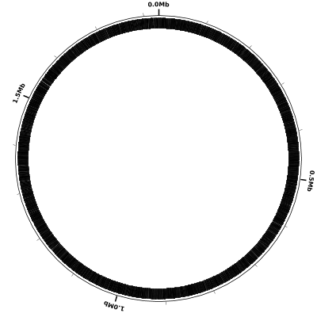
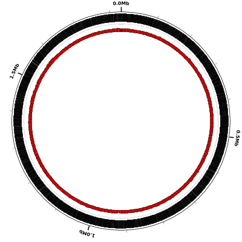
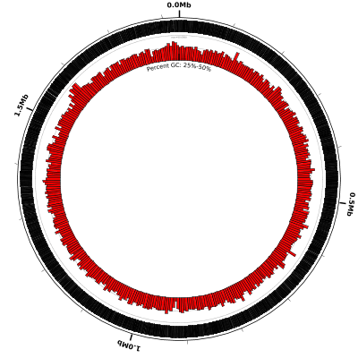
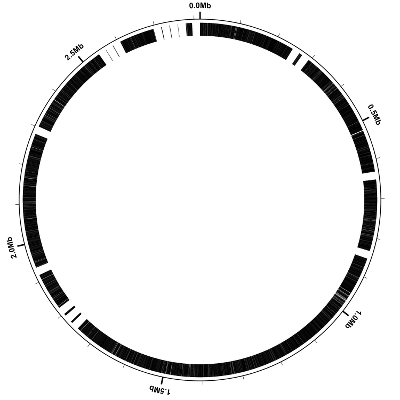
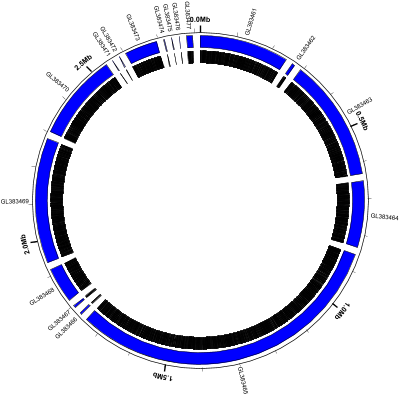
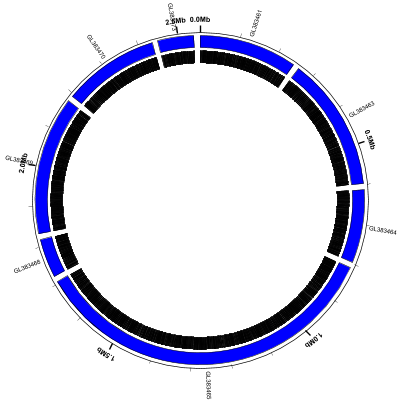
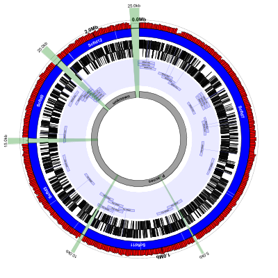

# GenBank Flat File Visualization

In this tutorial we'll show how to create a simple Circleator figure
for a genome sequence--and any associated annotation--in GenBank flat
file format. We'll look at two examples, one of which is a completed
microbial genome sequence, and one of which is an unfinished draft
genome sequence.  Before proceeding with the tutorial, please make
sure that you have Circleator installed as described in the Circleator
[Installation Guide][install].

[install]: {{site.baseurl}}/install.html

### Outline

* **[Example 1](#ex1): Completed Genome of _Haemophilus influenzae Rd KW20_**

  1. [Download the GenBank flat file](#ex1_download_gb_ff)
  2. [Download the Circleator configuration file](#ex1_download_config)
  3. [Run Circleator](#ex1_run_circleator)
  4. [Convert the figure from SVG to PNG](#ex1_convert_to_png)
  5. [Add a percent GC-content plot](#ex1_add_percentgc)
  6. [Magnify and highlight a region of interest](#ex1_highlight_region)

` `
 
* **[Example 2](#ex2): Draft Genome Sequence of _Propionibacterium acnes HL005PA3_**

  1. [Download the GenBank flat file](#ex2_download_gb_ff)
  2. [Download the Circleator configuration file](#ex2_download_config)
  3. [Run Circleator](#ex2_run_circleator)
  4. [Convert the figure from SVG to PNG](#ex2_convert_to_png)
  5. [Show the scaffold locations](#ex2_show_scaffolds)
  6. [Filter out the short sequences](#ex2_filter_out_short_seqs)
  7. [Add some flair](#ex2_add_flair)
  8. [Finer-grained control of contig/scaffold placement](#ex2_finer_scaffold_control)
  
  

***

## Example 1: Completed Genome of *Haemophilus influenzae Rd KW20*

### Download the GenBank flat file

The GenBank accession number for the *Haemophilus influenzae Rd KW20*
genome sequence is L42023.1. For convenience we've downloaded the
corresponding GenBank flat file and placed a copy on the same web server
as the Circleator tutorials (see below). Download this .gb file by
right-clicking on the link below and selecting "Save link as" or "Save
as". Save the file somewhere accessible because we'll be using it
as one of the inputs to Circleator:

[L42023.1.gb][hi_gb]

If you want to download a different genomic sequence entry you can do
so by using NCBI's GenBank web site, [as described here][gb_download].

[hi_gb]: {{site.baseurl}}/tutorials/gb_annotation/L42023.1.gb
[gb_download]: {{site.baseurl}}/tutorials/gb_annotation/gb_download.html

### Download the Circleator configuration file

Here is a very simple Circleator configuration file. Download it by 
right-clicking on the following link and selecting "Save link as" or 
"Save as":

[genes-only.txt][]

Take a look at the content of this file e.g., by using the cat command
in Linux/Unix:

    $ cat genes-only.txt

    coords
    small-cgap
    genes

Each of the lines in this file--and in any Circleator configuration
file--corresponds to exactly one circular "track" and, by default, the
first track listed in the file (i.e., **coords** in this case) is the
outermost one in the figure. Each successive track/line in the
configuration file is placed immediately inside the track before,
until the available space in the circle has been exhausted.

In this particular configuration file each of the lines contains a
single predefined track name (**coords**, **small-cgap**, and **genes**). These
predefined tracks display the following:

* **coords** - a circle representing the 1.83 Mb *H. influenzae Rd KW20* genome, with:
  * a tick mark drawn every 100 kb
  * a label (e.g., 0.0Mb, 0.5Mb) drawn every 0.5 Mb
* **small-cgap** - a small (circular) gap between the previous track and the next
* **genes** - a curved black rectangle at the location of each **gene** feature in the input GenBank file.

A more complete list of the predefined track types can be found on the
[predefined track types page][predef_tracks]. There is also a page that 
describes the [configuration file format][config_ff] in detail.

[predef_tracks]: {{site.baseurl}}/predefined-tracks.html
[config_ff]: {{site.baseurl}}/configuration.html

### Run Circleator

Now that we have both an input annotation file and a Circleator
configuration file, all that remains is to run Circleator, like so:

    $ circleator --data=L42023.1.gb --config=genes-only.txt --pad=100 > hinf-genes-only.svg

Note that Circleator prints its (SVG) output to stdout, so we must use
the shell redirection character (">") to place it into a file of our
choosing (hinf-genes-only.svg) Also, if the Circleator output includes
a warning about "Unrecognized DBSOURCE data" this may be ignored: it's
a warning generated by certain versions of BioPerl but it should not
affect the results. Here's what the Circleator output might look like
on the terminal after running the above command:

    INFO - started drawing figure using genes-only.txt 
    INFO - reading from annot_file=./L42023.1.gb, seq_file=, with seqlen=
    --------------------- WARNING --------------------- 
    MSG: Unrecognized DBSOURCE data: BioProject: PRJNA219
    --------------------------------------------------- 
    INFO - L42023: 3521 feature(s) and 1830138 bp of sequence 
    INFO - read 1 contig(s) from 1 input annotation and/or sequence file(s)
    INFO - finished drawing figure using genes-only.txt

### Convert the figure from SVG to PNG

SVG (Scalable Vector Graphics) format is a vector-based graphics
format, meaning that the image is composed of geometrical primitives
like lines, circles, and arcs. Magnifying a vector-based image does
not result in any loss of image quality, making SVG well-suited for
publication purposes, in which a very high-quality image is
desirable. Image formats like JPEG and PNG are “raster” (pixel-based)
formats, in which the image is made up of many colored rectangular
blocks (the pixels), like an LCD screen. Some programs, like Adobe
Illustrator, can view and manipulate SVG images directly. For many
purposes, however, it is convenient to have a pixel-based image
format. The rasterize-svg utility, distributed with Circleator, makes
use of the Apache Batik package to convert SVG images to either PNG,
JPEG, or PDF. (PDF is also a vector-based format, although both it and
SVG may _contain_ pixel-based images.) Converting our SVG-format
figure to a PNG image will take a few seconds, and can be done with
the following command:

    rasterize-svg hinf-genes-only.svg png 3000 3000

When rasterizing SVG it is necessary to specify the size of the
resulting raster image, and the "3000 3000" indicate that the image
should be 3000 pixels wide by 3000 pixels high. Here is the resulting
PNG image:

<em>hinf-genes-only.png</em> 
(data: <a href='gb_annotation/L42023.1.gb'>L42023.1.gb</a> config: <a href='gb_annotation/genes-only.txt'>genes-only.txt</a>, full size <a href='gb_annotation/hinf-genes-only-3000.png'>PNG</a>&nbsp;|&nbsp;<a href='gb_annotation/hinf-genes-only.svg'>SVG</a>)  

[genes-only.txt]: {{site.baseurl}}/tutorials/gb_annotation/genes-only.txt

### Add a percent GC-content plot

Now let's display a simple quantity computed directly from the DNA
sequence, namely the percent GC-content. Percent GC-content is
typically plotted using a sliding window and by default Circleator
uses nonoverlapping windows. Here is our sample configuration file
([genes-and-percentGC-1.txt][]) with another small circular gap
(**small-cgap**) and a default percent GC plot (**%GC0-100**):

    coords
    small-cgap
    genes
    small-cgap
    %GC0-100

Run Circleator as before, passing it both the configuration file and
the GenBank flat file and directing the output into a .svg file, and
then rasterize the SVG file:

    circleator --data=L42023.1.gb --config=genes-and-percentGC-1.txt --pad=100 > hinf-genes-pctgc-1.svg
    rasterize-svg hinf-genes-pctgc-1.svg png 3000 3000

[genes-and-percentGC-1.txt]: {{site.baseurl}}/tutorials/gb_annotation/genes-and-percentGC-1.txt

Here is the resulting figure:

<em>hinf-genes-pctgc-1.png</em> 
(config: <a href='gb_annotation/genes-and-percentGC-1.txt'>genes-and-percentGC-1.txt</a>, full size <a href='gb_annotation/hinf-genes-pctgc-1-3000.png'>PNG</a>&nbsp;|&nbsp;<a href='gb_annotation/hinf-genes-pctgc-1.svg'>SVG</a>)  

The percent GC plot doesn't appear to be very informative, although if
you look at one of the full-size figures you can see that the percent
GC content stays right around the average value (38.1%) pretty much
throughout the entire genome.  In fact, if we run Circleator with more
verbose debugging enabled (`--debug=misc` or `--debug=all`) then it 
will tell us the observed minimum and maximum values for each of the 
graphs it draws, like so:

       DEBUG - graph data observed min=28.18, max=47.72, avg=38.129371717411, nvals=367, g_baseline=range_min, g_min=0, g_max=100

This tells us that although the **%GC0-100** track is drawn with range 0-100 (`g_min=0, g_max=100`)
the actual observed minimum value (for the given default window size) is 28.18 and 
the observed maximum value is 47.72. We can modify the percent-GC graph to
show more detail by decreasing the range accordingly, perhaps to 0-50
or even 25-50. We can also increase the height of the graph to show more
detail, as in the following example configuration file:

    coords
    small-cgap
    genes
    small-cgap
    # decrease graph_max from 100 to 50, increase graph_min to 25
    # and increase heightf from 0.07 to 0.15:
    %GC0-100 graph_max=50,graph_min=25,heightf=0.15
    # add a label to make it clear what's going on:
    medium-label label-text=Percent&nbsp;GC:&nbsp;25%-50%

Run Circleator and rasterize the resulting SVG file:

    circleator --data=L42023.1.gb --config=genes-and-percentGC-2.txt --pad=100 --debug=misc > hinf-genes-pctgc-2.svg
    rasterize-svg hinf-genes-pctgc-2.svg png 3000 3000

And the figure now looks like this:

<em>hinf-genes-pctgc-2.png</em> 
(config: <a href='gb_annotation/genes-and-percentGC-2.txt'>genes-and-percentGC-2.txt</a>, full size <a href='gb_annotation/hinf-genes-pctgc-2-3000.png'>PNG</a>&nbsp;|&nbsp;<a href='gb_annotation/hinf-genes-pctgc-2.svg'>SVG</a>)  

### Magnify and highlight a region of interest

By default Circleator draws each genomic sequence to scale, but the
scale can be changed in order to show greater detail in regions of
interest (at the expense of having a figure that is no longer drawn to
scale.) In this next figure we'll use the **scaled-segment-list** track
type to modify the scale, expanding a single region from 910-930kb by
a factor of 25. Circleator will automatically _compress_ the scale for
the rest of the figure to compensate for the change. Let's run
Circleator and rasterize the resulting SVG file, and then talk about
what changes were made to the configuration file:

    circleator --data=L42023.1.gb --config=explore-region-1.txt --pad=100 --debug=misc > explore-region-1.svg
    rasterize-svg explore-region-1.svg 3000 3000

Here's what the result should look like. Notice that the highlighted
region at the bottom (highlighted in pink and labeled "25X") has been 
expanded compared to the rest of the figure:

<em>hinf-explore-region-1.png</em> 
(config: <a href='gb_annotation/explore-region-1.txt'>explore-region-1.txt</a>, full size <a href='gb_annotation/hinf-explore-region-1-3000.png'>PNG</a>&nbsp;|&nbsp;<a href='gb_annotation/hinf-explore-region-1.svg'>SVG</a>)  

The following two lines in [the configuration file](gb_annotation/explore-region-1.txt)
effect the change of scale:

    # zoom in 25X on the region from 910-930kb
    new r1 load user-feat-fmin=915000,user-feat-fmax=930000,user-feat-type=roi
    new ss1 scaled-segment-list scale=25,feat-type=roi

Note that any changes in scale will affect only the _subsequent_ lines
in the configuration file, which is why we've placed the
scale-changing lines above at the very beginning of the file. Note
also that we've broken the change of scale into two parts: in the
first line we define a new user-defined feature, with position
910-930kb and type "roi":

    new r1 load user-feat-fmin=915000,user-feat-fmax=930000,user-feat-type=roi

In the second line, we scale by a factor of 25X all those regions
covered by features of type "roi" i.e., the single region we just
created:

    new ss1 scaled-segment-list scale=25,feat-type=roi

The next several lines of the configuration file are identical to those
from the previous example and then the final four lines add some color
and labels to the expanded region:

    # highlight and label the zoomed region
    new h1 rectangle innerf=0,outerf=1.1,opacity=0.2,color1=purple,feat-type=roi
    coords outerf=1.1,fmin=915000,fmax=930000,tick-interval=1000,label-interval=5000,no-circle=1,label-units=kb,label-type=horizontal
    large-label innerf=0.4,label-text=25X,label-position=922500,label-type=horizontal
    medium-label innerf=0.7,label-type=spoke,label-function=locus,overlapping-feat-type=roi,feat-type=gene,packer=none,heightf=0.04

Let's look at each of these four lines in detail:

    new h1 rectangle innerf=0,outerf=1.1,opacity=0.2,color1=purple,feat-type=roi

The first field in any line is mandatory and must be either the name
of a predefined track or the keyword **new** otherwise (as in this
case.) The second optional field assigns a name to the track, **h1**
in this case. Assigning a unique name is recommended so that other
tracks may refer unambiguously to this one if needed. The third field
specifies the "glyph" or underlying graphical primitive to use, in
this case **rectangle**, the curved rectangle glyph that Circleator
uses for many of its tracks. The final field specifies the track
options, separated by commas. The options in this line are:

* **innerf=0** : the inner "edge" of the track is the very center of the circle
* **outerf=1.1** : the outer edge of the track is 110% of the circle's radius
* **opacity=0.2** : the track is 80% transparent
* **color=purple** : the track is shaded purple (light purple because of the opacity setting)
* **feat-type=roi** : only features of type "roi" (i.e., our single region of interest) are drawn

    coords outerf=1.1,fmin=915000,fmax=930000,tick-interval=1000,label-interval=5000,no-circle=1,label-units=kb,label-type=horizontal

The second line (above) uses the **coords** predefined track type,
which draws a circle and labels it with coordinate positions. We
already have a *coords* track in the configuration file, which draws a
full circle and then places a label every 0.5Mb. This **coords**
track, on the other hand, covers _only_ the region of interest
(**fmin=915000,fmax=930000**) and does not draw a circle, only tick
marks and labels (**no-circle=1**)

    large-label innerf=0.4,label-text=25X,label-position=922500,label-type=horizontal

The third line (above) uses the **large-label** predefined track type
to label the expanded region with a large "25X" label. Note that the
label has been positioned manually at the center of the region
(**label-position=922500**) and that a "horizontal" label type has
been chosen (as opposed to the default, which is to draw the label on
an arc of the circle.)

    medium-label innerf=0.7,label-type=spoke,label-function=locus,overlapping-feat-type=roi,feat-type=gene,packer=none,heightf=0.04

The fourth line (above) uses the **medium-label** predefined track
type to label each gene (**feat-type=gene**) with its locus id
(**label-function=locus**). The "spoke" **label-type** is used in this
case to minimize the amount of space (around the circle) taken up by
each label. Finally, _and crucially_, note that the
**overlapping-feat-type=roi** option restricts this labeling so that
_only_ gene features that also happen to overlap with the region of
interest are labeled in this manner. Without this option _all_ of the
genes would be labeled, and the labels for those not in the expanded
region would be hard or impossible to read because they'd be packed
too densely.

***

##  Example 2: Draft Genome Sequence of _Propionibacterium acnes HL005PA3_

### Download the GenBank flat file(s)

Unlike the _Haemophilus influenzae_ sequence, which is a single
finished sequence, the _Propionibacterium acnes_ sequence is a
high-quality draft that comprises 17 separate scaffolds. Each of the
17 scaffold sequences is a separate GenBank entry, and we could
download them as separate files, but the simplest approach is to
download a single GenBank flat file that contains all 17 sequences and
their associated annotation. For convenience we've placed a copy of
this GenBank file at the following location. Download it by
right-clicking on the link below and selecting "Save link as" or "Save
as". Save the file somewhere accessible because we'll be using it as
one of the inputs to Circleator:

[GL383461-GL383477.gb][pa_gb]

This file can also be downloaded from the GenBank web site with the
following sequence of steps:

1. Go to http://www.ncbi.nlm.nih.gov/genbank and search "All Databases" for "Propionibacterium acnes HL005PA3"
2. Click on the result row for "Assembly", to get to [this page](http://www.ncbi.nlm.nih.gov/assembly/GCF_000144345.1/).
3. Click on the "WGS Project" link, to get to [this page](http://www.ncbi.nlm.nih.gov/nuccore/ADZM00000000.1/).
4. Click on the "WGS_SCAFLD" link at the bottom ("GL383461-GL383477") to get to [this page](http://www.ncbi.nlm.nih.gov/nuccore?term=GL383461:GL383477[PACC]).
4. Use the "Send to:" pull-down menu at the top right to select "File" and "GenBank (full)" for the format
5. Click on "Create File"
6. Rename the downloaded file from "sequence.gb" to "GL383461-GL383477.gb"

[pa_gb]: {{site.baseurl}}/tutorials/gb_annotation/GL383461-GL383477.gb

### Download the Circleator configuration file

We'll start with the same Circleator configuration file that was used
in [Example 1](#ex1). If you have not already downloaded it, you may do so by
right-clicking on the following link and selecting "Save link as" or 
"Save as":

[genes-only.txt][]

Recall that this 3-line configuration file displays the coordinate system
labels and the gene features, and nothing else.

[genes-only.txt]: {{site.baseurl}}/tutorials/gb_annotation/genes-only.txt

### Run Circleator

Now that we have both an input annotation file and a Circleator
configuration file, all that remains is to run Circleator, like so:

    $ circleator --data=GL383461-GL383477.gb --config=genes-only.txt --pad=100 > pa-genes-only.svg

Notice that the Circleator output is slightly more verbose than in 
Example 1, because for each of the contigs and/or scaffolds in the
input file it prints a line giving the sequence length and feature
count:

    INFO - started drawing figure using genes-only.txt
    INFO - reading from annot_file=./GL383461-GL383477.gb, seq_file=, with seqlen=
    INFO - GL383461: 493 feature(s) and 246684 bp of sequence
    INFO - GL383462: 19 feature(s) and 8634 bp of sequence
    INFO - GL383463: 649 feature(s) and 336359 bp of sequence
    INFO - GL383464: 400 feature(s) and 182889 bp of sequence
    INFO - GL383465: 1862 feature(s) and 893497 bp of sequence
    INFO - GL383466: 5 feature(s) and 4650 bp of sequence
    INFO - GL383467: 9 feature(s) and 5617 bp of sequence
    INFO - GL383468: 219 feature(s) and 97238 bp of sequence
    INFO - GL383469: 766 feature(s) and 347101 bp of sequence
    INFO - GL383470: 518 feature(s) and 240912 bp of sequence
    INFO - GL383471: 5 feature(s) and 778 bp of sequence
    INFO - GL383472: 3 feature(s) and 1168 bp of sequence
    INFO - GL383473: 186 feature(s) and 90326 bp of sequence
    INFO - GL383474: 3 feature(s) and 1380 bp of sequence
    INFO - GL383475: 3 feature(s) and 889 bp of sequence
    INFO - GL383476: 5 feature(s) and 616 bp of sequence
    INFO - GL383477: 37 feature(s) and 16090 bp of sequence
    INFO - read 17 contig(s) from 1 input annotation and/or sequence file(s)
    INFO - finished drawing figure using genes-only.txt

### Convert the figure from SVG to PNG

As [in example 1](#ex1_convert_to_png), let's convert the SVG image to PNG:

    $ rasterize-svg pa-genes-only.svg png 3000 3000

Here is the result:

<em>pa-genes-only.png</em> 
(data: <a href='gb_annotation/GL383461-GL383477.gb'>GL383461-GL383477.gb</a> config: <a href='gb_annotation/genes-only.txt'>genes-only.txt</a>, full size <a href='gb_annotation/pa-genes-only-3000.png'>PNG</a>&nbsp;|&nbsp;<a href='gb_annotation/pa-genes-only.svg'>SVG</a>)  

`genes-only.txt`:

    coords
    small-cgap
    genes

Note that in this figure we have several gene-free regions, which did
not appear in example 1. The reason for this is that we have 17
scaffolds and, by default, Circleator places a 20 kb gap between each
pair of adjacent scaffolds or contigs. Also by default, Circleator
draws the contigs/scaffolds in the same order (clockwise, starting at
the origin) that they appear in the input GenBank file.

### Show the scaffold locations

Let's modify the configuration file slightly so that we can see the
scaffold locations and accession numbers in the figure. Here's the
updated configuration file:

[scaffolds-and-genes.txt][]

[scaffolds-and-genes.txt]: {{site.baseurl}}/tutorials/gb_annotation/scaffolds-and-genes.txt

Now run Circleator and convert the SVG figure to PNG format. Note that
we're increasing the `--pad` amount from 100 to 200 to make room for the
scaffold labels around the outside of the circle:

    $ circleator --data=GL383461-GL383477.gb --config=scaffolds-and-genes.txt --pad=200 > pa-scaffolds-and-genes.svg
    $ rasterize-svg pa-scaffolds-and-genes.svg png 3000 3000

[GL383461-GL383477.gb]: {{site.baseurl}}/tutorials/gb_annotation/GL383461-GL383477.gb

<em>pa-scaffolds-and-genes.png</em> 
(data: <a href='gb_annotation/GL383461-GL383477.gb'>GL383461-GL383477.gb</a> config: <a href='gb_annotation/scaffolds-and-genes.txt'>scaffolds-and-genes.txt</a>, full size <a href='gb_annotation/pa-scaffolds-and-genes-3000.png'>PNG</a>&nbsp;|&nbsp;<a href='gb_annotation/pa-scaffolds-and-genes.svg'>SVG</a>)  

`scaffolds-and-genes.txt`:

    coords
    small-cgap
    contigs c1
    small-cgap
    genes
    medium-label innerf=1.0,label-function=primary_id,feat-track=c1,label-type=spoke,packer=none

Note that:

* the `contigs` predefined track type displays each contig or scaffold as a blue curved rectangle
* we've given the `contigs` track a name (`c1`) so we can refer to it later
* the `medium-label` track at the end labels each scaffold with its primary_id/accession number
* `label-type=spoke` is used to prevent adjacent labels from overlapping
* `packer=none` tells Circleator not to try to move labels around to avoid collisions
* some of the scaffolds are _very_ small (616 bp according to the circleator output)

### Filter out the short sequences

Circleator has a couple of command-line options that affect the handling of multi-sequence
input data. One is `--contig_gap_size`, which can be used to change the default gap placed
between adjacent contigs/scaffolds (20kb by default). Another is `--contig_min_size`, which
specifies a minimum contig/scaffold length (in bp). Sequences that are shorter than this 
will be excluded from the display. Let's use these two options, along with the same 
configuration file as the previous example, to change the figure a bit:

    $ circleator --data=GL383461-GL383477.gb --config=scaffolds-and-genes.txt --pad=200 --contig_min_size=50000 --contig_gap_size=15000 > pa-no-short-scaffolds.svg
    $ rasterize-svg pa-no-short-scaffolds.svg png 3000 3000

Circleator reports that only 8 of the 17 scaffolds are 50kb or longer:

    INFO - started drawing figure using scaffolds-and-genes.txt
    INFO - reading from annot_file=./GL383461-GL383477.gb, seq_file=, with seqlen=
    INFO - GL383461: 493 feature(s) and 246684 bp of sequence
    INFO - GL383463: 649 feature(s) and 336359 bp of sequence
    INFO - GL383464: 400 feature(s) and 182889 bp of sequence
    INFO - GL383465: 1862 feature(s) and 893497 bp of sequence
    INFO - GL383468: 219 feature(s) and 97238 bp of sequence
    INFO - GL383469: 766 feature(s) and 347101 bp of sequence
    INFO - GL383470: 518 feature(s) and 240912 bp of sequence
    INFO - GL383473: 186 feature(s) and 90326 bp of sequence
    INFO - read 8 contig(s) from 1 input annotation and/or sequence file(s)
    INFO - finished drawing figure using scaffolds-and-genes.txt

<em>pa-no-short-scaffolds.png</em> 
(data: <a href='gb_annotation/GL383461-GL383477.gb'>GL383461-GL383477.gb</a> config: <a href='gb_annotation/scaffolds-and-genes.txt'>scaffolds-and-genes.txt</a>, full size <a href='gb_annotation/pa-no-short-scaffolds-3000.png'>PNG</a>&nbsp;|&nbsp;<a href='gb_annotation/pa-no-short-scaffolds.svg'>SVG</a>)  

Note that:

* the coordinate labels (`coords`) around the outside of the circle include the gaps as well as the scaffold sequences
* some of the scaffold labels are colliding with the coordinate labels

### Add some flair

Now let's make the figure a little more interesting by adding some
tracks and, since all of the scaffolds are now relatively long,
overlaying the scaffold id directly on the curved blue scaffold
rectangles. Here's the updated configuration file:

[scaffolds-and-genes-plus.txt][]

    $ circleator --data=GL383461-GL383477.gb --config=scaffolds-and-genes-plus.txt --pad=200 --contig_min_size=50000 --contig_gap_size=15000 > pa-no-short-scaffolds-plus.svg
    $ rasterize-svg pa-no-short-scaffolds-plus.svg png 3000 3000

[scaffolds-and-genes-plus.txt]: {{site.baseurl}}/tutorials/gb_annotation/scaffolds-and-genes-plus.txt

<em>pa-no-short-scaffolds.png</em> 
(data: <a href='gb_annotation/GL383461-GL383477.gb'>GL383461-GL383477.gb</a> config: <a href='gb_annotation/scaffolds-and-genes-plus.txt'>scaffolds-and-genes-plus.txt</a>, full size <a href='gb_annotation/pa-no-short-scaffolds-plus-3000.png'>PNG</a>&nbsp;|&nbsp;<a href='gb_annotation/pa-no-short-scaffolds-plus.svg'>SVG</a>)  

`scaffolds-and-genes-plus.txt`:
    
    # percent-GC graph with coordinates overlaid
    %GC0-100 graph-min=40,graph-max=70,no-labels=1
    coords label-interval=1000000,innerf=same
    
    contigs c1
    # show assembly gaps as light lines on the blue scaffolds
    new ag rectangle innerf=same,outerf=same,feat-type=assembly_gap,color1=white,color2=white,stroke-width=2.5,opacity=0.7
    # label each scaffold with its accession number
    medium-label innerf=same+0.01,label-function=primary_id,feat-track=c1,text-color=white,packer=none,font-weight=bold
    tiny-cgap
    
    # invisible tRNAs
    small-cgap
    tRNAs trnas heightf=0.01,color1=none,color2=none
    
    genes-fwd
    genes-rev
    small-cgap
    
    # link back to invisible tRNAs from a few tracks before
    new r1 rectangle heightf=0.01,color1=#eaeaff,color2=#eaeaff
    new r2 rectangle heightf=0.2,color1=#eaeaff,color2=#eaeaff
    large-label heightf=0.2,outerf=same,feat-track=trnas,style=signpost,label-function=product,draw-link=1,color1=#d0d0f0,color2=#7070f0,link-color=#7070f0,stroke-width=1.5,font-width-frac=3.5
    new r3 rectangle heightf=0.01,color1=#eaeaff,color2=#eaeaff
    
    # figure caption
    small-cgap
    new fc1 label 0.07 innerf=0.075,label-text=Propionibacterium&nbsp;acnes&nbsp;HL005PA3,font-style=italic,label-type=horizontal
    new fc2 label 0.06 innerf=0.01,label-text=all&nbsp;scaffolds&nbsp;>&equals;&nbsp;50kb,label-type=horizontal

There's a lot going on here, so let's take it line-by-line. Note that 
ines that start with "#" are comments and are ignored by Circleator:

    # percent-GC graph with coordinates overlaid

We've changed the percent-GC graph range from 0-100 to 40-70. This is
because the artificial 15 kb gaps between the scaffolds are runs of
"N"s, which have 0% GC-content, and without these gap regions the
actual minimum %GC would be significantly higher (and would depend on
the nonoverlapping graph window size, which is 5 kb by deafult.)
Setting `no-labels=1` prevents the min/max labels on the graph from
overlapping the "0.0 Mb" coordinate label:

    %GC0-100 graph-min=40,graph-max=70,no-labels=1

Since the %GC graph comes _before_ the `coords` track it is drawn underneath it. This is why
both tracks are visible even though the `opacity` option was not used. Note that we've
changed the `label-interval` to 1 Mb (to prevent the "2.5 Mb" label from running into the
"0 Mb" label.) and have set `innerf=same`, which means that the inner edge of this track
(`coords`) should be set to the same value as the inner edge of the preceding track (the 
percent-GC graph). This forces the two to overlap:

    coords label-interval=1000000,innerf=same

The contigs appear as blue rectangles, as before:
    
    contigs c1

The input GenBank file contains some features of type "assembly_gap",
to indicate the location of unclosed gaps in the scaffold
sequences. Here we draw them as slightly transparent (`opacity=0.7`)
white rectangles (`color1=white,color2=white`) overlaid on the
preceding track (`outerf=same,innerf=same`).  Setting
`feat-type=assembly_gap` ensures that only features of type
"assembly_gap" will be highlighted in this manner. Finally, since the
assembly gaps are all very small with respect to the total sequence
length, we'll draw them slightly larger than they actually are in
order to ensure that they're visible (`stroke-width=2.5`). Note that
`stroke-width` is a CSS property that's used in SVG to specify how
wide lines should be drawn. The `rectangle` glyph is a curved
rectangle with both a border (whose thickness is controlled by the
stroke-width) and also a filled interior. The two color options
(`color1` and `color2`) determine what color to draw the border lines
and fill the interior:

    # show assembly gaps as light lines on the blue scaffolds
    new ag rectangle innerf=same,outerf=same,feat-type=assembly_gap,color1=white,color2=white,stroke-width=2.5,opacity=0.7

The next track overlays the accession number of each scaffold on the 
blue rectangle of the scaffold itself. We set `innerf=same+0.1` to indicate
that the label should be slightly _higher_ (i.e., closer to the outside of the
circle) than the inside edge of the previous track (which is actually the
gap-highlight track but that's OK, because it also has `innerf=0`) 
The `feat-track` specifies which features are being labeled (the contigs
from the track named `c1`) and the `label-function` specifies _how_ they
should be labeled (with their primary id.) The remaining options specify 
the color (`text-color=white`) and font weight (`font-weight=bold`) and
`packer=none` tells Circleator not to move the labels around vertically 
to avoid collisions (because we know that the scaffolds are relatively large
and the accession numbers are relatively small, so there shouldn't be
any collisions):

    # label each scaffold with its accession number
    medium-label innerf=same+0.01,label-function=primary_id,feat-track=c1,text-color=white,packer=none,font-weight=bold
    tiny-cgap

Next we create a track just for the tRNA features and we give it a
name (`trnas`.) We're making it very small (`heightf=0.01`) and we're
also making it invisible (!), by setting `color1=none,color2=none`. 
That's because we dont actually want to draw the tRNAs until after
we're done drawing the genes, _but_ we want to draw connecting lines
back up to this track position so it's clear where the tRNAs are
located relative to the other genes:
    
    # invisible tRNAs
    small-cgap
    tRNAs trnas heightf=0.01,color1=none,color2=none

Now we'll draw the gene features. The only difference here is that we've
split forward and reverse-strand genes into distinct tracks:
    
    genes-fwd
    genes-rev
    small-cgap

Now we're ready to show the tRNA features.

    # link back to invisible tRNAs from a few tracks before
    new r1 rectangle heightf=0.01,color1=#eaeaff,color2=#eaeaff
    new r2 rectangle heightf=0.2,color1=#eaeaff,color2=#eaeaff
    large-label heightf=0.2,outerf=same,feat-track=trnas,style=signpost,label-function=product,draw-link=1,color1=#d0d0f0,color2=#7070f0,link-color=#7070f0,stroke-width=1.5,font-width-frac=3.5
    new r3 rectangle heightf=0.01,color1=#eaeaff,color2=#eaeaff

Finally we're going to add some text in the middle of the figure to
let people know what they're looking at:
    
    # figure caption
    small-cgap
    new fc1 label 0.07 innerf=0.075,label-text=Propionibacterium&nbsp;acnes&nbsp;HL005PA3,font-style=italic,label-type=horizontal
    new fc2 label 0.06 innerf=0.01,label-text=all&nbsp;scaffolds&nbsp;>&equals;&nbsp;50kb,label-type=horizontal

### Finer-grained control of contig/scaffold placement

For finer-grained control over the placement of contigs or scaffolds in a multi-sequence figure
we have to use the `--contig_list` command line option, [as described here][contig_list_docs].
With this option it is possible to:

* Use reference sequences from multiple input files
* Specify the order _and orientation_ of each sequence
* Specify the gap to place between each pair of adjacent sequences
* Tag sequences that belong to the same source genome (for displaying multiple reference genomes/organisms)

[contig_list_docs]: {{site.baseurl}}/command-line.html#command_line_options

When using `--contig_list` it's assumed that each input
contig/scaffold is in a separate file (that contains nothing else),
and each line of the (tab-delimited text) file referenced by
`--contig_list` gives the location of one sequence. Here's the
`--contig_list` file for our next example,
[pa-scaffolds-1.txt](gb_annotation/pa-scaffolds-1.txt). It lists
the 5 longest _P. acnes_ scaffolds, in order of decreasing size:

    Scfld7			GL383465.gb	
    gap		5000			
    Scfld11			GL383469.gb	
    gap		10000			
    Scfld5			GL383463.gb	
    gap		15000			
    Scfld0			GL383461.gb	
    gap		20000			
    genome	P. acnes				
    Scfld12			GL383470.gb	
    gap		25000			
    genome	unknown				

And here are the individual .gb files referenced in this `contig_list` file:

 * [GL383465.gb](gb_annotation/GL383465.gb)
 * [GL383469.gb](gb_annotation/GL383469.gb)
 * [GL383463.gb](gb_annotation/GL383463.gb)
 * [GL383461.gb](gb_annotation/GL383461.gb)
 * [GL383470.gb](gb_annotation/GL383470.gb)

Note that:

 * We've used the scaffold id (e.g., Scfld11) rather than the GenBank accession as the primary id for each sequence.
 * This file format is very sensitive to whitespace and each line _must_ have at least 5 tab-delimited fields (even if some of them are empty, as is the case here.)
 * We've placed a gap between each pair of scaffolds, using an increasing gap size (5kb, 10kb, 15kb, etc.) Circleator will automatically create a feature of type 'contig_gap' for each one. (It does not use 'gap' as the feature type as many GenBank files already contain features of this type.)
 * There are two `genome` lines. These have the effect of declaring all previous scaffolds (that have not yet been assigned to a genome/organism) as coming from that genome. Circleator will automatically create a feature of type 'genome' that spans all the relevant contigs/scaffolds.
 * When we run Circleator (see below) we'll use the `--contig_list` option in place of the `--data` and/or `--sequence` options.

Now let's run Circleator and convert the SVG to PNG. For this to work correctly your current directory must contain not only the configuration file, but also the `contig_list` file *and* all 5 of the ".gb" files that it references:

    $ circleator --contig_list=pa-scaffolds-1.txt  --config=scaffolds-and-genes-plus-contig-list.txt --pad=200 > pa-contig-list-1.svg
    $ rasterize-svg pa-contig-list-1.svg png 3000 3000

<em>pa-contig-list-1.png</em> 
(data: <a href='gb_annotation/GL383465.gb'>GL383465.gb</a>, <a href='gb_annotation/GL383469.gb'>GL383469.gb</a>, <a href='gb_annotation/GL383463.gb'>GL383463.gb</a>, <a href='gb_annotation/GL383461.gb'>GL383461.gb</a>, <a href='gb_annotation/GL383470.gb'>GL383470.gb</a> config: <a href='gb_annotation/scaffolds-and-genes-plus-contig-list.txt'>scaffolds-and-genes-plus-contig-list.txt</a>, full size <a href='gb_annotation/pa-contig-list-1-3000.png'>PNG</a>&nbsp;|&nbsp;<a href='gb_annotation/pa-contig-list-1.svg'>SVG</a>)  

`scaffolds-and-genes-plus-contig-list.txt`:

    # percent-GC graph with coordinates overlaid
    %GC0-100 graph-min=40,graph-max=70,no-labels=1
    coords label-interval=1000000,innerf=same
    
    contigs c1
    # show assembly gaps as light lines on the blue scaffolds
    new ag rectangle innerf=same,outerf=same,feat-type=assembly_gap,color1=white,color2=white,stroke-width=2.5,opacity=0.7
    # label each scaffold with its accession number
    medium-label innerf=same+0.01,label-function=primary_id,feat-track=c1,text-color=white,packer=none,font-weight=bold
    tiny-cgap
    
    # invisible tRNAs
    small-cgap
    tRNAs trnas heightf=0.01,color1=none,color2=none
    
    genes-fwd
    genes-rev
    small-cgap
    
    # link back to invisible tRNAs from a few tracks before
    new r1 rectangle heightf=0.01,color1=#eaeaff,color2=#eaeaff
    new r2 rectangle heightf=0.2,color1=#eaeaff,color2=#eaeaff
    large-label heightf=0.2,outerf=same,feat-track=trnas,style=signpost,label-function=product,draw-link=1,color1=#d0d0f0,color2=#7070f0,link-color=#7070f0,stroke-width=1.5,font-width-frac=3.5
    new r3 rectangle heightf=0.01,color1=#eaeaff,color2=#eaeaff
    
    # display 'genome' feature from contig_list file
    new gr1 rectangle outerf=0.4,heightf=0.05,feat-type=genome,color1=#a0a0a0,color2=#000000,stroke-width=2
    medium-label grl1 innerf=same,label-function=primary_id,feat-track=gr1,font-weight=bold
    
    # highlight gaps between scaffolds/contigs
    new cg1 rectangle innerf=same,outerf=1.1,feat-type=contig_gap,opacity=0.3,color1=green,color2=darkgreen,stroke-width=2
    medium-label cgl1 innerf=1.1,feat-track=cg1,label-function=length_kb

This configuration file is almost identical to the previous one. The
only differences are that we've removed the lines responsible for
drawing the figure caption in the center of circle, and have added
about 7 new lines at the end. The first of those lines (see below)
draw and label the `genome` features that were created because of the
corresponding genome lines in the input contig file. They appear as
the grey curved rectangles in the middle. For demonstration purposes
we've labeled Scfld12 as "unknown" (in the contig list file, not the
config. file) even though it's also a sequence from _P. acnes_

    # display 'genome' feature from contig_list file
    new gr1 rectangle outerf=0.4,heightf=0.05,feat-type=genome,color1=#a0a0a0,color2=#000000,stroke-width=2
    medium-label grl1 innerf=same,label-function=primary_id,feat-track=gr1,font-weight=bold

The last 3 lines highlight the newly-created `contig_gap` features in
green and use the `length_kb` label function to automatically label
each one with its length. As you can see in the figure, these
contig_gaps correspond exactly to what was specified in the
`contig_list` file.
    
    # highlight gaps between scaffolds/contigs
    new cg1 rectangle innerf=same,outerf=1.1,feat-type=contig_gap,opacity=0.3,color1=green,color2=darkgreen,stroke-width=2
    medium-label cgl1 innerf=1.1,feat-track=cg1,label-function=length_kb
