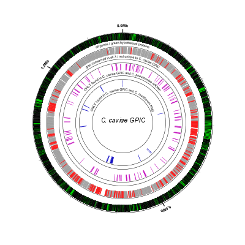
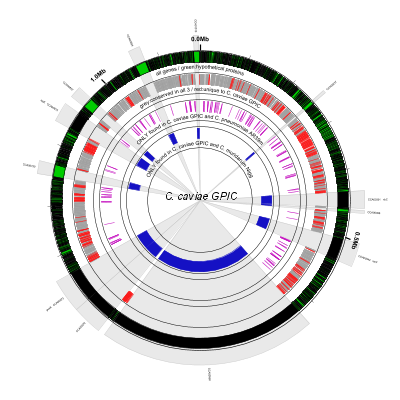
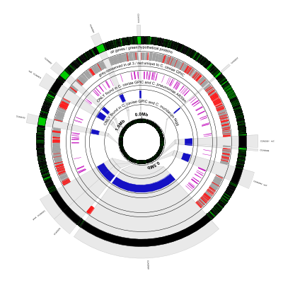

# Gene Conservation Visualization

In this tutorial we'll show how to use Circleator to visualize patterns
of gene conservation in two or more closely-related bacterial strains
or serovars. Before proceeding with this tutorial, please make
sure that you have Circleator installed as described in the Circleator
[Installation Guide][install].

[install]: {{site.baseurl}}/install.html

### Outline

* **[Example 1](#ex1): BLAST Score Ratio (BSR) Output**

  1. [Download the input and configuration files](#ex1_download_files)
  2. [Run Circleator](#ex1_run_circleator)
  3. [Convert the figure from SVG to PNG](#ex1_convert_to_png)
  4. [Display *which* genes are conserved](#ex1_show_conserved)
  5. [Add unscaled inner circle](#ex1_add_unscaled_inner)

***

## Example 1: BLAST Score Ratio (BSR) Output

The [BLAST Score Ratio (BSR) Analysis Tool][bsr] is a method and tool
for normalizing raw BLAST scores in order to visualize the degree of
proteome similarity between three genomes. Circleator can parse output
from the BSR Analysis Tool and, although the tool itself is limited to
3-way comparisons, Circleator can combine output from multiple 3-way
BSR runs (with a query genome in common) to visualize comparisons of
arbitrary numbers of genomes.

We'll start by drawing a Circleator figure for the BSR output from the
test files distributed with the tool (the "TEST FILES" link on the
[BSR home page][bsr].) This example is a comparison of the following
3 genomes:

 1. _Chlamydophila caviae_ GPIC (NC_003361.3)
 2. _Chlamydia muridarum_ Nigg  (NC_002620.2)
 3. _Chlamydophila pneumoniae_ AR39 (NC_002179.2)

[bsr]: http://bsr.igs.umaryland.edu/

### Download the input and configuration files

To draw the figure we'll need the following input files:

* The GenBank flat file for our reference genome, _Chlamydophila caviae_ GPIC: [NC_003361.3.gbk][gb_file]
* The main BSR output file: [Cc_GPIC_Cm_Nigg_Cp_AR39.txt][bsr_file]
* A Circleator configuration file: [bsr-1.txt][fig1_config_file]

[gb_file]: {{site.baseurl}}/tutorials/gene_conservation/NC_003361.3.gbk
[bsr_file]: {{site.baseurl}}/tutorials/gene_conservation/Cc_GPIC_Cm_Nigg_Cp_AR39.txt
[fig1_config_file]: {{site.baseurl}}/tutorials/gene_conservation/bsr-1.txt

### Run Circleator

Now that we have an input annotation file, the BSR output, and a Circleator
configuration file, all that remains is to run Circleator, like so:

    $ circleator --data=NC_003361.3.gbk --config=bsr-1.txt > bsr-1.svg

### Convert the figure from SVG to PNG

Let's convert the SVG image to PNG for viewing:

    $ rasterize-svg bsr-1.svg png 3000 3000

Here is the result:

<em>bsr-1.png</em> 
(data: <a href='gene_conservation/NC_003361.3.gbk'>NC_003361.3.gbk</a> config: <a href='gene_conservation/bsr-1.txt'>bsr-1.txt</a>, full size <a href='gene_conservation/bsr-1-3000.png'>PNG</a>&nbsp;|&nbsp;<a href='gene_conservation/bsr-1.svg'>SVG</a>)  

There's a lot going on in the configuration file for this figure, so let's break it down a few lines at a time. The task of the
first line is simply to read the BSR output file and assign aliases ("Cm" for _Chlamydia muridarum_ Nigg and "Cp" for
_Chlamydophila pneumoniae_ AR39) to the two non-reference genomes used in the comparison:

    # read BSR output and assign aliases to the two query genomes ("Cm", "Cp")
    new load_bsr1 load-bsr heightf=0,bsr-file=./Cc_GPIC_Cm_Nigg_Cp_AR39.txt,genome1=Cm,genome2=Cp
    

The next couple of lines draw the labeled coordinate sequence axis ("0.0Mb", etc.) followed by a small gap:

    # draw ruler/coordinates
    coords
    
    tiny-cgap

The next few lines are responsible for drawing the black and green outer circle. Black (curved) rectangles are drawn
for every gene feature in the reference. Next, green rectangles are overlaid on top of the black ones to indicate which
genes' proteins are annotated as hypothetical. Here's the line that draws all the genes in black (the default color):

    genes

And here's the line that overlays green on the hypotheticals. The options `innerf=same` and `outerf=same` tell Circleator
to place this track exactly over (i.e., on top of) the previous one. The `feat-tag` and `feat-tag-regex` options say to
look at the `product` feature tag and find any CDS features whose product matches "hypothetical protein":

    # highlight conserved hypotheticals
    new HCH rectangle feat-type=CDS,feat-tag=product,feat-tag-regex=hypothetical\sprotein,innerf=same,outerf=same,opacity=0.8,color1=#00ff00

The next two lines print a label and then leave a small gap:

    medium-label label-text=all&nbsp;genes&nbsp;/&nbsp;green:hypothetical&nbsp;proteins
    small-cgap
    
These lines draw a thin grey circle and leave a small gap:

    # genes that are present in all 3 genomes
    new CH1 rectangle color1=none,color2=#000000,heightf=0.14,feat-type=contig
    tiny-cgap outerf=same

This line draws genes conserved in all 3 genomes in grey. The crucial options are `genomes=Cm|Cp` and `signature=11`.
The first of these options lists the non-reference genomes that we want to filter on, and the second of the options
gives the filter to use, in which "0" means "this strain must NOT be present" and "1" means "this strain MUST be 
present." "11" means to display only genes that are conserved in *both* query genomes, Cm and Cp. Since conservation
is calculated relative to the reference we know that the gene is conserved in the reference:

    new bsr_all bsr 0.07 threshold=0.4,genomes=Cm|Cp,signature=11,color1=#a0a0a0,color2=#a0a0a0

Now we change the signature from "11" to "00" to find genes that are present in the reference, but NOT either of the
query strains. These genes are colored green:

    # genes that are unique to the reference
    new bsr_ref bsr 0.07 threshold=0.4,genomes=Cm|Cp,signature=00,color1=#f91919,color2=#f91919,innerf=same

Label and gap:

    medium-label label-text=grey:conserved&nbsp;in&nbsp;all&nbsp;3&nbsp;/&nbsp;red:unique&nbsp;to&nbsp;C.&nbsp;caviae&nbsp;GPIC
    medium-cgap
    
Grey circle and gap:

    # genes that are present only in the reference and Chlamydophila pneumoniae AR39
    new CH1 rectangle color1=none,color2=#000000,heightf=0.14,feat-type=contig
    tiny-cgap outerf=same

Now we're showing genes that are present in the reference and Cp, but NOT Cm (i.e., signature="01"):

    new bsr_cp bsr 0.07 threshold=0.4,genomes=Cm|Cp,signature=01,color1=#c411be,color2=#c411be

Label and gap:

    medium-label label-text=ONLY&nbsp;found&nbsp;in&nbsp;C.&nbsp;caviae&nbsp;GPIC&nbsp;and&nbsp;C.&nbsp;pneumoniae&nbsp;AR39m
    medium-cgap

Grey circle and gap:
    
    # genes that are present only in the reference and Chlamydia muridarum Nigg
    new CH2 rectangle color1=none,color2=#000000,heightf=0.14,feat-type=contig
    tiny-cgap outerf=same

Finally we're showing genes that are present in the reference and CM, but NOT Cp (i.e., signature="10"):

    new bsr_cm bsr 0.07 threshold=0.4,genomes=Cm|Cp,signature=10,color1=#1511c4,color2=#1511c4
    medium-label label-text=ONLY&nbsp;found&nbsp;in&nbsp;C.&nbsp;caviae&nbsp;GPIC&nbsp;and&nbsp;C.&nbsp;muridarum&nbsp;Nigg

Place a caption/figure title in the center of the image:
    
    # caption
    large-label innerf=0,label-text=C.&nbsp;caviae&nbsp;GPIC,label-type=horizontal,font-style=italic

### Display *which* genes are conserved

This figure is interesting, but we'd really like to be able to see *which* genes are conserved. The 
following configuration file uses the `scaled-segment-list` glyph to selectively expand (i.e., increase
the scale of) a subset of the genes, which gives us enough space in the figure to add the genes'
locus ids and, for those that have them, gene symbols. Here's the configuration file:

[bsr-2.txt][fig2_config_file]

[fig2_config_file]: {{site.baseurl}}/tutorials/gene_conservation/bsr-2.txt

Using this configuration file, run Circleator again using the same reference data, but this time send the
output to bsr-2.svg and then convert it to PNG format:

    $ circleator --data=NC_003361.3.gbk --config=bsr-2.txt > bsr-2.svg
    $ rasterize-svg bsr-2.svg png 3000 3000

<em>bsr-2.png</em> 
(data: <a href='gene_conservation/NC_003361.3.gbk'>NC_003361.3.gbk</a> config: <a href='gene_conservation/bsr-2.txt'>bsr-2.txt</a>, full size <a href='gene_conservation/bsr-2-3000.png'>PNG</a>&nbsp;|&nbsp;<a href='gene_conservation/bsr-2.svg'>SVG</a>)  

Only a few lines were added to bsr-1.txt to get to bsr-2.txt and achieve this effect. First, we define the 
sequence regions to be expanded, corresponding to all genes with a BSR signature of "10" i.e., genes that 
are present in the reference and Cm but not Cp. Setting the height of this track to zero (the "0" in column
4) ensures makes these features invisible and note that we've named this track `bsr_cm_d`:

    # expand each BSR region by 25X 
    new bsr_cm_d bsr 0 threshold=0.4,genomes=Cm|Cp,signature=10,color1=none,color2=none

Next we use the `scaled-segment-list` type to expand all the features from the previous track 
(`feat-track=bsr_cm_d`) by a factor of 25 (`scale=25`):

    new ssl1 scaled-segment-list feat-track=bsr_cm_d,scale=25

The next line shades each of the expanded regions grey. Since this track is drawn before any of the genes
or other annotation it won't obscure them from view. Note that we've set `feat-track=ssl1` to indicate
that the `scaled-segment-list` features should be expanded, but we could also have set `feat-track=bsr_cm_d`
and achieved the same result:

    # highlight expanded regions
    new hssl1 rectangle feat-track=ssl1,opacity=0.2,innerf=0,outerf=1.1,color1=#909090,color2=black

In the next two tracks we again refer back to the expanded features, this time using `feat-track=bsr_cm_d`,
in order to print the locus id (`gene-function=locus`) and gene symbol (`gene-function=tag,tag-name=gene`) 
for each of the highlighted and expanded genes:
    
    # label genes with locus and gene id
    small-label lg1 innerf=1.12,label-function=locus,feat-track=bsr_cm_d,packer=none,label-type=spoke
    small-label lg2 innerf=1.22,label-function=tag,tag-name=gene,feat-track=bsr_cm_d,packer=none,label-type=spoke

Finally, the following line in bsr-1.txt:

    coords

was changed to this in bsr-2.txt. Setting `innerf=1.0` resets the position of the coordinate labeling track
after drawing the gene locus ids and gene symbols around the outside of the image. If we had not made this 
change then the sequence coordinate labels would appear immediately inside the previous track, which in 
this case would be the gene symbol labels:

    coords innerf=1.0

### Add unscaled inner circle

Abrupt scale changes can be somewhat confusing and disorienting. One way to ameliorate the problem is to 
display an *unscaled* representation of the reference sequence in the middle of the figure and then use
shading to depict the expansion of scale at the loci of interest. In this next figure we've made some 
slight modifications to do just that. The configuration file for the new figure is here:

[bsr-3.txt][fig3_config_file]

[fig3_config_file]: {{site.baseurl}}/tutorials/gene_conservation/bsr-3.txt

Rerun Circleator and the rasterizer with the new configuration file:

    $ circleator --data=NC_003361.3.gbk --config=bsr-3.txt > bsr-3.svg
    $ rasterize-svg bsr-3.svg png 3000 3000

Here's what the result looks like:

<em>bsr-3.png</em> 
(data: <a href='gene_conservation/NC_003361.3.gbk'>NC_003361.3.gbk</a> config: <a href='gene_conservation/bsr-3.txt'>bsr-3.txt</a>, full size <a href='gene_conservation/bsr-3-3000.png'>PNG</a>&nbsp;|&nbsp;<a href='gene_conservation/bsr-3.svg'>SVG</a>)  

