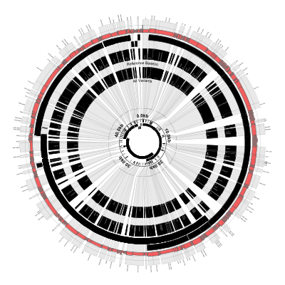

# Displaying SNPs and indels

In this tutorial we'll cover using Circleator to display SNPs and indels
between closely-related strains. Before proceeding with the tutorial, 
please make sure that you have Circleator installed as described in the 
Circleator [Installation Guide][install].

[install]: {{site.baseurl}}/install.html

### Outline

* **[Example 1](#ex1): Reading variants from VCF files**

  1. [Download the input and configuration files](#ex1_download_files)
  2. [Run Circleator](#ex1_run_circleator)
  3. [Convert the figure from SVG to PNG](#ex1_convert_to_png)
  4. [Blow things up](#ex1_blow_things_up)

***

## Reading variants from VCF files

### Download the input and configuration files

In this first example we'll look at displaying variants (SNPs, insertions,
and deletions) from VCF files. We're going to use the same reference 
genome, that of *Enterobacteria* phage lambda, as in Examples 1 and 2 from 
the [Coverage Plots tutorial][coverage_plots]. In that tutorial we used 
[Bowtie2][bt2] to align the synthetic read data provided with Bowtie against
the phage lambda genome, as described in [the Bowtie2 documentation][bt2_ex].
The Bowtie2 documentation also describes how to call variants and generate a
VCF file with the samtools package and one of the BAM alignment files. 
We'll use that VCF file for our first Circleator example. There's just one
small difference between the samtools command in the Bowtie documentation 
and the one that we're going to use, because we want to generate a ".vcf" 
file rather than a ".bcf" file (i.e., a plain VCF file rather than a 
binary-encoded VCF file.) So instead of the following command, from the 
Bowtie2 documentation:

    samtools mpileup -uf lambda_virus.fa eg2.sorted.bam | bcftools view -bvcg - > eg2.raw.bcf

We will instead use this command (with no -b flag and ".vcf" instead of ".bcf"):

    samtools mpileup -uf lambda_virus.fa eg2.sorted.bam | bcftools view -vcg - > eg2.raw.vcf

Here is the VCF file that this command should produce, assuming that it's 
run on the `eg2.sorted.bam` file from the Coverage Plots tutorial:

[eg2.raw.vcf][]

Here is the GenBank flat file for the phage lambda genome:

[NC_001416.1.gb][pl_gb]

Here is the contig list file that reads the GenBank flat file but which tells Circleator to use 
"gi|9626243|ref|NC_001416.1|" as the id for the sequence that it contains, instead of "NC_001416".
This file is passed to Circleator's `--contig_list` option, rather than passing the GenBank flat
file directly to the `--data` option. Without this indirection Circleator won't be able to match
the variants in the VCF file (which are looking for a sequence with id "gi|9626243|ref|NC_001416.1|",
not "NC_001416") with the reference sequence. This id-matching issue is also described in the 
[Coverage Plots tutorial][coverage_plots].

[contig-list-ex1-gb.txt][]

And here is the Circleator configuration file for our first figure:

[variants-ex1.txt][]

[coverage_plots]: {{site.baseurl}}/tutorials/coverage_plots.html
[bt2]: http://bowtie-bio.sourceforge.net/bowtie2
[bt2_ex]: http://bowtie-bio.sourceforge.net/bowtie2/manual.shtml#getting-started-with-bowtie-2-lambda-phage-example
[eg2.raw.vcf]: {{site.baseurl}}/tutorials/snps_and_indels/eg2.raw.vcf
[pl_gb]: {{site.baseurl}}/tutorials/coverage_plots/NC_001416.1.gb

### Run Circleator

Once you've downloaded or generated the necessary files, you're ready to run Circleator, like so:

    $ circleator --contig_list=contig-list-ex1-gb.txt --config=variants-ex1.txt > variants-ex1.svg

### Convert the figure from SVG to PNG

If everything looks good so far then use `rasterize-svg` to convert the SVG to a PNG file:

    $ rasterize-svg variants-ex1.svg png 3000 3000

Here's what the result should look like:

<em>variants-ex1.png</em> 
(data: <a href='snps_and_indels/lambda_virus.fa'>lambda_virus.fa</a> config: <a href='snps_and_indels/variants-ex1.txt'>variants-ex1.txt</a>, full size <a href='snps_and_indels/variants-ex1-3000.png'>PNG</a>&nbsp;|&nbsp;<a href='snps_and_indels/variants-ex1.svg'>SVG</a>)  

[variants-ex1.txt]: {{site.baseurl}}/tutorials/snps_and_indels/variants-ex1.txt
[contig-list-ex1-gb.txt]: {{site.baseurl}}/tutorials/snps_and_indels/contig-list-ex1-gb.txt

### Blow things up

This type of figure is useful for visualizing where the SNPs and indels tend to cluster, but does not provide 
as much detail as the VCF file. One thing we can do is "blow up" or expand the variant loci (i.e., manipulate
the scale of the figure around the circumference of the circle so that the regions of interest are expanded or
stretched and all the other regions are compressed accordingly.) We can do this with the `scaled-segment-list`
glyph in Circleator and, once the scale has been changed, we will have more space to overlay useful information
on the variant loci. We'll use the same input contig list file, GenBank flat file, and VCF file, but the
following modified Circleator configuration file:

[contig-list-ex1b-gb.txt][]

Save the above file and rerun Circleator, replacing the original configuration file with the new one (and
changing the name of the output SVG and PNG files):

    $ circleator --contig_list=contig-list-ex1-gb.txt --config=variants-ex1b.txt > variants-ex1b.svg
    $ rasterize-svg variants-ex1b.svg png 3000 3000

<em>variants-ex1b.png</em> 
(data: <a href='snps_and_indels/lambda_virus.fa'>lambda_virus.fa</a> config: <a href='snps_and_indels/variants-ex1b.txt'>variants-ex1b.txt</a>, full size <a href='snps_and_indels/variants-ex1b-3000.png'>PNG</a>&nbsp;|&nbsp;<a href='snps_and_indels/variants-ex1b.svg'>SVG</a>)  

In this version of the figure, notice that:

* Each variant locus is shaded grey and expanded by about 100X
* The coordinate labels have been relocated to the inside of the figure
* The reference and variant base(s) are now overlaid on the figure
* Each variant locus is labeled with its base position (the outermost part of the figure)
* The small inner circle shows the genes and SNPs _without_ any scaling
* Some of the called variants overlap (e.g., position 12580-12585)

[contig-list-ex1b-gb.txt]: {{site.baseurl}}/tutorials/snps_and_indels/contig-list-ex1b-gb.txt